

  

# Overview

# Camp List

<table id="monsterList" class="monsterPageTable">
  <tr>
    <th colspan="6">Camp</th>
  </tr>
  <tr>
    <th class="highlightNormal">1</th>
    <th class="highlightNormal">2</th>
    <th class="highlightNormal">3</th>
    <th class="highlightNormal">4</th>
    <th class="highlightNormal">5</th>
    <th class="highlightNormal">6</th>
  </tr>
  <tr>
    <td class="highlightGrey"><a href="#wild-plains">Wild Plains</a></td>
    <td><a href="#secretive-forest">Secretive Forest</a></td>
    <td class="highlightGrey"><a href="#crater">Crater</a></td>
    <td><a href="#bountiful-sea">Bountiful Sea</a></td>
    <td class="highlightGrey"><a href="#aged-chamber-a-n">Aged Chamber A-N</a></td>
    <td><a href="#rainbow-peak">Rainbow Peak</a></td>
  </tr>
  <tr>
    <td class="highlightGrey"><a href="#sky-blue-plains">Sky-Blue Plains</a></td>
    <td><a href="#vibrant-forest">Vibrant Forest</a></td>
    <td class="highlightGrey"><a href="#echo-cave">Echo Cave</a></td>
    <td><a href="#serene-sea">Serene Sea</a></td>
    <td class="highlightGrey"><a href="#aged-chamber-o-?">Aged Chamber O-?</a></td>
    <td><a href="#healing-forest">Healing Forest</a></td>
  </tr>
  <tr>
    <td class="highlightGrey"><a href="#beau-plains">Beau Plains</a></td>
    <td><a href="#mushroom-forest">Mushroom Forest</a></td>
    <td class="highlightGrey"><a href="#boulder-cave">Boulder Cave</a></td>
    <td><a href="#treasure-sea">Treasure Sea</a></td>
    <td class="highlightGrey"><a href="#ancient-relic">Ancient Relic</a></td>
    <td><a href="#southern-island">Southern Island</a></td>
  </tr>
  <tr>
    <td class="highlightGrey"><a href="#thunder-crag">Thunder Crag</a></td>
    <td><a href="#overgrown-forest">Overgrown Forest</a></td>
    <td class="highlightGrey"><a href="#frigid-cavern">Frigid Cavern</a></td>
    <td><a href="#deepsea-floor">Deepsea Floor</a></td>
    <td class="highlightGrey"><a href="#mt.-moonview">Mt. Moonview</a></td>
    <td><a href="#seafloor-cave">Seafloor Cave</a></td>
  </tr>
  <tr>
    <td class="highlightGrey"><a href="#power-plant">Power Plant</a></td>
    <td><a href="#jungle">Jungle</a></td>
    <td class="highlightGrey"><a href="#tadpole-pond">Tadpole Pond</a></td>
    <td><a href="#decrepit-lab">Decrepit Lab</a></td>
    <td class="highlightGrey"><a href="#darkness-ridge">Darkness Ridge</a></td>
    <td><a href="#volcanic-pit">Volcanic Pit</a></td>
  </tr>
  <tr>
    <td class="highlightGrey"><a href="#mt.-discipline">Mt. Discipline</a></td>
    <td><a href="#poison-swamp">Poison Swamp</a></td>
    <td class="highlightGrey"><a href="#turtleshell-pond">Turtleshell Pond</a></td>
    <td><a href="#waterfall-lake">Waterfall Lake</a></td>
    <td class="highlightGrey"><a href="#legendary-island">Legendary Island</a></td>
    <td><a href="#stratos-lookout">Stratos Lookout</a></td>
  </tr>
  <tr>
    <td class="highlightGrey"><a href="#mt.-green">Mt. Green</a></td>
    <td><a href="#safari">Safari</a></td>
    <td class="highlightGrey"><a href="#rub-a-dub-river">Rub-a-Dub River</a></td>
    <td><a href="#evolution-forest">Evolution Forest</a></td>
    <td class="highlightGrey"><a href="#cryptic-cave">Cryptic Cave</a></td>
    <td><a href="#enclosed-island">Enclosed Island</a></td>
  </tr>
  <tr>
    <td class="highlightGrey"><a href="#mt.-cleft">Mt. Cleft</a></td>
    <td><a href="#withering-desert">Withering Desert</a></td>
    <td class="highlightGrey"><a href="#gourd-swamp">Gourd Swamp</a></td>
    <td><a href="#mystic-lake">Mystic Lake</a></td>
    <td class="highlightGrey"><a href="#final-island">Final Island</a></td>
    <td></td>
  </tr>
  <tr>
    <td class="highlightGrey"><a href="#stump-forest">Stump Forest</a></td>
    <td><a href="#ravaged-field">Ravaged Field</a></td>
    <td class="highlightGrey"><a href="#ice-floe-beach">Ice Floe Beach</a></td>
    <td><a href="#magnetic-quarry">Magnetic Quarry</a></td>
    <td class="highlightGrey"><a href="#sacred-field">Sacred Field</a></td>
    <td></td>
  </tr>
  <tr>
    <td class="highlightGrey"><a href="#flyaway-forest">Flyaway Forest</a></td>
    <td><a href="#scorched-plains">Scorched Plains</a></td>
    <td class="highlightGrey"><a href="#shallow-beach">Shallow Beach</a></td>
    <td><a href="#dragon-cave">Dragon Cave</a></td>
    <td class="highlightGrey"><a href="#deepsea-current">Deepsea Current</a></td>
    <td></td>
  </tr>
</table>

#### Wild Plains

<table class="itemListCentered">
  <tr>
    <th>Image</th>
    <th>Unlock Condition</th>
  </tr>
    <tr>
    <td rowspan="3" class="camp_background"></td>
    <td>Beginning</td>
  </tr>
  <tr>
    <th>Pokemon</th>
  </tr>
  <tr>
    <td class="camp_pokemon">
 Rattata
　
 Raticate
　
 Ekans
　
 Arbok
　
 Farfetch'd
　
 Drowzee
　
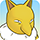 Hypno
</td>
    <td class="camp_pokemon">
 Poochyena
　
 Mightyena
　
 Zigzagoon
　
 Linoone
　
 Zangoose
　
 Seviper
</td>
  </tr>
</table>

#### Sky-Blue Plains

<table class="itemListCentered">
  <tr>
    <th>Image</th>
    <th>Unlock Condition</th>
  </tr>
    <tr>
    <td rowspan="3" class="camp_background"></td>
    <td>Beginning</td>
  </tr>
  <tr>
    <th>Pokemon</th>
  </tr>
  <tr>
    <td class="camp_pokemon">
 Igglybuff
　
 Jigglypuff
　
 Wigglytuff
　
 Lickitung
　
 Lickilicky
　
 Happiny
　
 Chansey
　
 Blissey
</td>
    <td class="camp_pokemon">
 Girafarig
　
 Snubbull
　
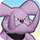 Granbull
　
 Smeargle
　
 Ralts
　
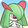 Kirlia
　
 Gardevoir
　
 Gallade
</td>
  </tr>
</table>

#### Beau Plains

<table class="itemListCentered">
  <tr>
    <th>Image</th>
    <th>Unlock Condition</th>
  </tr>
    <tr>
    <td rowspan="3" class="camp_background"></td>
    <td>Purchase for 2700 Poke</td>
  </tr>
  <tr>
    <th>Pokemon</th>
  </tr>
  <tr>
    <td class="camp_pokemon">
 Bulbasaur
　
 Ivysaur
　
 Venusaur
　
 Chikorita
　
 Bayleef
　
 Meganium
　
 Hoppip
</td>
    <td class="camp_pokemon">
 Skiploom
　
 Jumpluff
　
 Taillow
　
 Swellow
　
 Budew
　
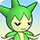 Roselia
　
 Roserade
</td>
  </tr>
</table>

#### Thunder Crag

<table class="itemListCentered">
  <tr>
    <th>Image</th>
    <th>Unlock Condition</th>
  </tr>
    <tr>
    <td rowspan="3" class="camp_background"></td>
    <td>Purchase for 600 Poke</td>
  </tr>
  <tr>
    <th>Pokemon</th>
  </tr>
  <tr>
    <td class="camp_pokemon">
 Sentret
　
 Furret
　
 Mareep
　
 Flaaffy
　
 Ampharos
　
 Electrike
</td>
    <td class="camp_pokemon">
 Manectric
　
 Plusle
　
 Minun
　
 Castform
　
 Chingling
　
 Chimecho
</td>
  </tr>
</table>

#### Power Plant

<table class="itemListCentered">
  <tr>
    <th>Image</th>
    <th>Unlock Condition</th>
  </tr>
    <tr>
    <td rowspan="3" class="camp_background"></td>
    <td>Beginning</td>
  </tr>
  <tr>
    <th>Pokemon</th>
  </tr>
  <tr>
    <td class="camp_pokemon">
 Magnemite
　
 Magneton
　
 Magnezone
　
 Voltorb
</td>
    <td class="camp_pokemon">
 Electrode
　
 Elekid
　
 Electabuzz
　
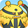 Electivire
</td>
  </tr>
</table>

#### Mt. Discipline

<table class="itemListCentered">
  <tr>
    <th>Image</th>
    <th>Unlock Condition</th>
  </tr>
    <tr>
    <td rowspan="3" class="camp_background"></td>
    <td>Purchase for 700 Poke</td>
  </tr>
  <tr>
    <th>Pokemon</th>
  </tr>
  <tr>
    <td class="camp_pokemon">
 Machop
　
 Machoke
　
 Machamp
　
 Tyrogue
　
 Hitmonlee
　
 Hitmonchan
</td>
    <td class="camp_pokemon">
 Hitmontop
　
 Makuhita
　
 Hariyama
　
 Meditite
　
 Medicham
　
 Riolu
　
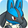 Lucario
</td>
  </tr>
</table>

#### Mt. Green

<table class="itemListCentered">
  <tr>
    <th>Image</th>
    <th>Unlock Condition</th>
  </tr>
    <tr>
    <td rowspan="3" class="camp_background"></td>
    <td>Purchase for 700 Poke</td>
  </tr>
  <tr>
    <th>Pokemon</th>
  </tr>
  <tr>
    <td class="camp_pokemon">
 Geodude
　
 Graveler
　
 Golem
　
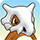 Cubone
　
 Marowak
　
 Gligar
　
 Gliscor
</td>
    <td class="camp_pokemon">
 Shuckle
　
 Teddiursa
　
 Ursaring
　
 Spoink
　
 Grumpig
　
 Spinda
</td>
  </tr>
</table>

#### Mt. Cleft

<table class="itemListCentered">
  <tr>
    <th>Image</th>
    <th>Unlock Condition</th>
  </tr>
    <tr>
    <td rowspan="3" class="camp_background"></td>
    <td>Purchase for 700 Poke</td>
  </tr>
  <tr>
    <th>Pokemon</th>
  </tr>
  <tr>
    <td class="camp_pokemon">
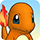 Charmander
　
 Charmeleon
　
 Charizard
　
 Larvitar
</td>
    <td class="camp_pokemon">
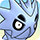 Pupitar
　
 Tyranitar
　
 Aron
　
 Lairon
　
 Aggron
</td>
  </tr>
</table>

#### Stump Forest

<table class="itemListCentered">
  <tr>
    <th>Image</th>
    <th>Unlock Condition</th>
  </tr>
    <tr>
    <td rowspan="3" class="camp_background"></td>
    <td>Beginning</td>
  </tr>
  <tr>
    <th>Pokemon</th>
  </tr>
  <tr>
    <td class="camp_pokemon">
 Caterpie
　
 Metapod
　
 Butterfree
　
 Weedle
　
 Kakuna
　
 Beedrill
　
 Ledyba
　
 Ledian
</td>
    <td class="camp_pokemon">
 Yanma
　
 Yanmega
　
 Wurmple
　
 Silcoon
　
 Beautifly
　
 Cascoon
　
 Dustox
</td>
  </tr>
</table>

#### Flyaway Forest

<table class="itemListCentered">
  <tr>
    <th>Image</th>
    <th>Unlock Condition</th>
  </tr>
    <tr>
    <td rowspan="3" class="camp_background"></td>
    <td>Purchase for 500 Poke</td>
  </tr>
  <tr>
    <th>Pokemon</th>
  </tr>
  <tr>
    <td class="camp_pokemon">
 Pidgey
　
 Pidgeotto
　
 Pidgeot
　
 Hoothoot
　
 Noctowl
　
 Togepi
　
 Togetic
</td>
    <td class="camp_pokemon">
 Togekiss
　
 Natu
　
 Xatu
　
 Murkrow
　
 Honchkrow
　
 Swablu
　
 Altaria
</td>
  </tr>
</table>

#### Secretive Forest

<table class="itemListCentered">
  <tr>
    <th>Image</th>
    <th>Unlock Condition</th>
  </tr>
    <tr>
    <td rowspan="3" class="camp_background"></td>
    <td>Purchase for 900 Poke</td>
  </tr>
  <tr>
    <th>Pokemon</th>
  </tr>
  <tr>
    <td class="camp_pokemon">
 Venonat
　
 Venomoth
　
 Spinarak
　
 Ariados
</td>
    <td class="camp_pokemon">
 Pineco
　
 Forretress
　
 Nincada
　
 Ninjask
　
 Shedinja
</td>
  </tr>
</table>

#### Vibrant Forest

<table class="itemListCentered">
  <tr>
    <th>Image</th>
    <th>Unlock Condition</th>
  </tr>
    <tr>
    <td rowspan="3" class="camp_background"></td>
    <td>Purchase for 800 Poke</td>
  </tr>
  <tr>
    <th>Pokemon</th>
  </tr>
  <tr>
    <td class="camp_pokemon">
 Pichu
　
 Pikachu
　
 Raichu
　
 Meowth
　
 Persian
　
 Mankey
　
 Primeape
　
 Munchlax
</td>
    <td class="camp_pokemon">
 Snorlax
　
 Aipom
　
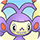 Ambipom
　
 Stantler
　
 Slakoth
　
 Vigoroth
　
 Slaking
　
 Skitty
　
 Delcatty
</td>
  </tr>
</table>

#### Mushroom Forest

<table class="itemListCentered">
  <tr>
    <th>Image</th>
    <th>Unlock Condition</th>
  </tr>
    <tr>
    <td rowspan="3" class="camp_background"></td>
    <td>Purchase for 800 Poke</td>
  </tr>
  <tr>
    <th>Pokemon</th>
  </tr>
  <tr>
    <td class="camp_pokemon">
 Paras
　
 Parasect
　
 Seedot
　
 Nuzleaf
　
 Shiftry
　
 Shroomish
　
 Breloom
</td>
  </tr>
</table>

#### Overgrown Forest

<table class="itemListCentered">
  <tr>
    <th>Image</th>
    <th>Unlock Condition</th>
  </tr>
    <tr>
    <td rowspan="3" class="camp_background"></td>
    <td>Purchase for 700 Poke</td>
  </tr>
  <tr>
    <th>Pokemon</th>
  </tr>
  <tr>
    <td class="camp_pokemon">
 Scyther
　
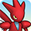 Scizor
　
 Pinsir
　
 Bonsly
　
 Sudowoodo
</td>
    <td class="camp_pokemon">
 Heracross
　
 Treecko
　
 Grovyle
　
 Sceptile
　
 Kecleon
</td>
  </tr>
</table>

#### Jungle

<table class="itemListCentered">
  <tr>
    <th>Image</th>
    <th>Unlock Condition</th>
  </tr>
    <tr>
    <td rowspan="3" class="camp_background">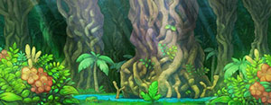</td>
    <td>Purchase for 500 Poke</td>
  </tr>
  <tr>
    <th>Pokemon</th>
  </tr>
  <tr>
    <td class="camp_pokemon">
 Oddish
　
 Gloom
　
 Vileplume
　
 Bellossom
　
 Bellsprout
　
 Weepinbell
　
 Victreebel
</td>
    <td class="camp_pokemon">
 Exeggcute
　
 Exeggutor
　
 Tangela
　
 Tangrowth
　
 Sunkern
　
 Sunflora
　
 Tropius
</td>
  </tr>
</table>

#### Poison Swamp

<table class="itemListCentered">
  <tr>
    <th>Image</th>
    <th>Unlock Condition</th>
  </tr>
    <tr>
    <td rowspan="3" class="camp_background"></td>
    <td>Purchase for 7000 Poke</td>
  </tr>
  <tr>
    <th>Pokemon</th>
  </tr>
  <tr>
    <td class="camp_pokemon">
 Grimer
　
 Muk
　
 Koffing
　
 Weezing
　
 Gulpin
　
 Swalot
</td>
  </tr>
</table>

#### Safari

<table class="itemListCentered">
  <tr>
    <th>Image</th>
    <th>Unlock Condition</th>
  </tr>
    <tr>
    <td rowspan="3" class="camp_background"></td>
    <td>Purchase for 600 Poke</td>
  </tr>
  <tr>
    <th>Pokemon</th>
  </tr>
  <tr>
    <td class="camp_pokemon">
 Nidoran♀
　
 Nidorina
　
 Nidoqueen
　
 Nidoran♂
　
 Nidorino
　
 Nidoking
　
 Doduo
　
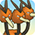 Dodrio
</td>
    <td class="camp_pokemon">
 Rhyhorn
　
 Rhydon
　
 Rhyperior
　
 Kangaskhan
　
 Tauros
　
 Phanpy
　
 Donphan
　
 Miltank
</td>
  </tr>
</table>

#### Withering Desert

<table class="itemListCentered">
  <tr>
    <th>Image</th>
    <th>Unlock Condition</th>
  </tr>
    <tr>
    <td rowspan="3" class="camp_background"></td>
    <td>Purchase for 900 Poke</td>
  </tr>
  <tr>
    <th>Pokemon</th>
  </tr>
  <tr>
    <td class="camp_pokemon">
 Sandshrew
　
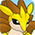 Sandslash
　
 Trapinch
　
 Vibrava
　
 Flygon
　
 Cacnea
　
 Cacturne
</td>
  </tr>
</table>

#### Ravaged Field

<table class="itemListCentered">
  <tr>
    <th>Image</th>
    <th>Unlock Condition</th>
  </tr>
    <tr>
    <td rowspan="3" class="camp_background"></td>
    <td>Purchase for 700 Poke</td>
  </tr>
  <tr>
    <th>Pokemon</th>
  </tr>
  <tr>
    <td class="camp_pokemon">
 Spearow
　
 Fearow
　
 Skarmory
　
 Houndour
　
 Houndoom
</td>
  </tr>
</table>

#### Scorched Plains

<table class="itemListCentered">
  <tr>
    <th>Image</th>
    <th>Unlock Condition</th>
  </tr>
    <tr>
    <td rowspan="3" class="camp_background"></td>
    <td>Purchase for 700 Poke</td>
  </tr>
  <tr>
    <th>Pokemon</th>
  </tr>
  <tr>
    <td class="camp_pokemon">
 Growlithe
　
 Arcanine
　
 Ponyta
　
 Rapidash
　
 Cyndaquil
</td>
    <td class="camp_pokemon">
 Quilava
　
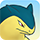 Typhlosion
　
 Torchic
　
 Combusken
　
 Blaziken
</td>
  </tr>
</table>

#### Crater

<table class="itemListCentered">
  <tr>
    <th>Image</th>
    <th>Unlock Condition</th>
  </tr>
    <tr>
    <td rowspan="3" class="camp_background"></td>
    <td>Purchase for 5000 Poke</td>
  </tr>
  <tr>
    <th>Pokemon</th>
  </tr>
  <tr>
    <td class="camp_pokemon">
 Magby
　
 Magmar
　
 Magmortar
　
 Slugma
　
 Magcargo
　
 Numel
　
 Camerupt
　
 Torkoal
</td>
  </tr>
</table>

#### Echo Cave

<table class="itemListCentered">
  <tr>
    <th>Image</th>
    <th>Unlock Condition</th>
  </tr>
    <tr>
    <td rowspan="3" class="camp_background"></td>
    <td>Purchase for 2700 Poke</td>
  </tr>
  <tr>
    <th>Pokemon</th>
  </tr>
  <tr>
    <td class="camp_pokemon">
 Zubat
　
 Golbat
　
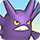 Crobat
　
 Wynaut
　
 Wobbuffet
　
 Dunsparce
</td>
    <td class="camp_pokemon">
 Whismur
　
 Loudred
　
 Exploud
　
 Nosepass
　
 Probopass
　
 Mawile
</td>
  </tr>
</table>

#### Boulder Cave

<table class="itemListCentered">
  <tr>
    <th>Image</th>
    <th>Unlock Condition</th>
  </tr>
    <tr>
    <td rowspan="3" class="camp_background"></td>
    <td>Purchase for 700 Poke</td>
  </tr>
  <tr>
    <th>Pokemon</th>
  </tr>
  <tr>
    <td class="camp_pokemon">
 Diglett
　
 Dugtrio
　
 Onix
　
 Steelix
</td>
  </tr>
</table>

#### Frigid Cavern

<table class="itemListCentered">
  <tr>
    <th>Image</th>
    <th>Unlock Condition</th>
  </tr>
    <tr>
    <td rowspan="3" class="camp_background"></td>
    <td>Purchase for 800 Poke</td>
  </tr>
  <tr>
    <th>Pokemon</th>
  </tr>
  <tr>
    <td class="camp_pokemon">
 Smoochum
　
 Jynx
　
 Swinub
　
 Piloswine
　
 Mamoswine
</td>
    <td class="camp_pokemon">
 Delibird
　
 Snorunt
　
 Glalie
　
 Froslass
</td>
  </tr>
</table>

#### Tadpole Pond

<table class="itemListCentered">
  <tr>
    <th>Image</th>
    <th>Unlock Condition</th>
  </tr>
    <tr>
    <td rowspan="3" class="camp_background"></td>
    <td>Purchase for 900 Poke</td>
  </tr>
  <tr>
    <th>Pokemon</th>
  </tr>
  <tr>
    <td class="camp_pokemon">
 Poliwag
　
 Poliwhirl
　
 Poliwrath
　
 Politoed
</td>
    <td class="camp_pokemon">
 Lotad
　
 Lombre
　
 Ludicolo
　
 Surskit
　
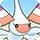 Masquerain
</td>
  </tr>
</table>

#### Turtleshell Pond

<table class="itemListCentered">
  <tr>
    <th>Image</th>
    <th>Unlock Condition</th>
  </tr>
    <tr>
    <td rowspan="3" class="camp_background"></td>
    <td>Purchase for 6000 Poke</td>
  </tr>
  <tr>
    <th>Pokemon</th>
  </tr>
  <tr>
    <td class="camp_pokemon">
 Squirtle
　
 Wartortle
　
 Blastoise
　
 Psyduck
　
 Golduck
</td>
    <td class="camp_pokemon">
 Azurill
　
 Marill
　
 Azumarill
　
 Corphish
　
 Crawdaunt
</td>
  </tr>
</table>

#### Rub-a-Dub River

<table class="itemListCentered">
  <tr>
    <th>Image</th>
    <th>Unlock Condition</th>
  </tr>
    <tr>
    <td rowspan="3" class="camp_background"></td>
    <td>Purchase for 3000 Poke</td>
  </tr>
  <tr>
    <th>Pokemon</th>
  </tr>
  <tr>
    <td class="camp_pokemon">
 Goldeen
　
 Seaking
　
 Totodile
　
 Croconaw
　
 Feraligatr
　
 Volbeat
　
 Illumise
</td>
  </tr>
</table>

#### Gourd Swamp

<table class="itemListCentered">
  <tr>
    <th>Image</th>
    <th>Unlock Condition</th>
  </tr>
    <tr>
    <td rowspan="3" class="camp_background"></td>
    <td>Purchase for 9000 Poke</td>
  </tr>
  <tr>
    <th>Pokemon</th>
  </tr>
  <tr>
    <td class="camp_pokemon">
 Wooper
　
 Quagsire
　
 Mudkip
　
 Marshtomp
　
 Swampert
　
 Barboach
　
 Whiscash
</td>
  </tr>
</table>

#### Ice Floe Beach

<table class="itemListCentered">
  <tr>
    <th>Image</th>
    <th>Unlock Condition</th>
  </tr>
    <tr>
    <td rowspan="3" class="camp_background"></td>
    <td>Purchase for 6000 Poke</td>
  </tr>
  <tr>
    <th>Pokemon</th>
  </tr>
  <tr>
    <td class="camp_pokemon">
 Seel
　
 Dewgong
　
 Spheal
　
 Sealeo
　
 Walrein
</td>
  </tr>
</table>

#### Shallow Beach

<table class="itemListCentered">
  <tr>
    <th>Image</th>
    <th>Unlock Condition</th>
  </tr>
    <tr>
    <td rowspan="3" class="camp_background"></td>
    <td>Purchase for 9000 Poke</td>
  </tr>
  <tr>
    <th>Pokemon</th>
  </tr>
  <tr>
    <td class="camp_pokemon">
 Krabby
　
 Kingler
　
 Corsola
　
 Wingull
　
 Pelipper
</td>
  </tr>
</table>

#### Bountiful Sea

<table class="itemListCentered">
  <tr>
    <th>Image</th>
    <th>Unlock Condition</th>
  </tr>
    <tr>
    <td rowspan="3" class="camp_background"></td>
    <td>Purchase for 9000 Poke</td>
  </tr>
  <tr>
    <th>Pokemon</th>
  </tr>
  <tr>
    <td class="camp_pokemon">
 Tentacool
　
 Tentacruel
　
 Slowpoke
　
 Slowbro
</td>
    <td class="camp_pokemon">
 Slowking
　
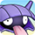 Shellder
　
 Cloyster
　
 Staryu
　
 Starmie
</td>
  </tr>
</table>

#### Serene Sea

<table class="itemListCentered">
  <tr>
    <th>Image</th>
    <th>Unlock Condition</th>
  </tr>
    <tr>
    <td rowspan="3" class="camp_background"></td>
    <td>Purchase for 9000 Poke</td>
  </tr>
  <tr>
    <th>Pokemon</th>
  </tr>
  <tr>
    <td class="camp_pokemon">
 Qwilfish
　
 Mantyke
　
 Mantine
　
 Wailmer
　
 Wailord
</td>
  </tr>
</table>

#### Treasure Sea

<table class="itemListCentered">
  <tr>
    <th>Image</th>
    <th>Unlock Condition</th>
  </tr>
    <tr>
    <td rowspan="3" class="camp_background"></td>
    <td>Purchase for 9000 Poke</td>
  </tr>
  <tr>
    <th>Pokemon</th>
  </tr>
  <tr>
    <td class="camp_pokemon">
 Horsea
　
 Seadra
　
 Kingdra
　
 Remoraid
　
 Octillery
</td>
    <td class="camp_pokemon">
 Carvanha
　
 Sharpedo
　
 Anorith
　
 Armaldo
　
 Luvdisc
</td>
  </tr>
</table>

#### Deepsea Floor

<table class="itemListCentered">
  <tr>
    <th>Image</th>
    <th>Unlock Condition</th>
  </tr>
    <tr>
    <td rowspan="3" class="camp_background"></td>
    <td>Purchase for 9000 Poke</td>
  </tr>
  <tr>
    <th>Pokemon</th>
  </tr>
  <tr>
    <td class="camp_pokemon">
 Omanyte
　
 Omastar
　
 Kabuto
　
 Kabutops
　
 Chinchou
　
 Lanturn
</td>
    <td class="camp_pokemon">
 Lileep
　
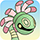 Cradily
　
 Clamperl
　
 Huntail
　
 Gorebyss
　
 Relicanth
</td>
  </tr>
</table>

#### Decrepit Lab

<table class="itemListCentered">
  <tr>
    <th>Image</th>
    <th>Unlock Condition</th>
  </tr>
    <tr>
    <td rowspan="3" class="camp_background">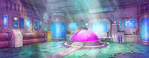</td>
    <td>Purchase for 6000 Poke</td>
  </tr>
  <tr>
    <th>Pokemon</th>
  </tr>
  <tr>
    <td class="camp_pokemon">
 Abra
　
 Kadabra
　
 Alakazam
　
 Mime Jr.
　
 Mr. Mime
</td>
    <td class="camp_pokemon">
 Ditto
　
 Porygon
　
 Porygon2
　
 Porygon-Z
</td>
  </tr>
</table>

#### Waterfall Lake

<table class="itemListCentered">
  <tr>
    <th>Image</th>
    <th>Unlock Condition</th>
  </tr>
    <tr>
    <td rowspan="3" class="camp_background"></td>
    <td>Purchase for 9000 Poke</td>
  </tr>
  <tr>
    <th>Pokemon</th>
  </tr>
  <tr>
    <td class="camp_pokemon">
 Magikarp
　
 Gyarados
　
 Feebas
　
 Milotic
</td>
  </tr>
</table>

#### Evolution Forest

<table class="itemListCentered">
  <tr>
    <th>Image</th>
    <th>Unlock Condition</th>
  </tr>
    <tr>
    <td rowspan="3" class="camp_background"></td>
    <td>Purchase for 9000 Poke</td>
  </tr>
  <tr>
    <th>Pokemon</th>
  </tr>
  <tr>
    <td class="camp_pokemon">
 Eevee
　
 Vaporeon
　
 Jolteon
　
 Flareon
　
 Espeon
</td>
    <td class="camp_pokemon">
 Umbreon
　
 Leafeon
　
 Glaceon
　
 Sylveon
</td>
  </tr>
</table>

#### Mystic Lake

<table class="itemListCentered">
  <tr>
    <th>Image</th>
    <th>Unlock Condition</th>
  </tr>
    <tr>
    <td rowspan="3" class="camp_background"></td>
    <td>Purchase for 2500 Poke</td>
  </tr>
  <tr>
    <th>Pokemon</th>
  </tr>
  <tr>
    <td class="camp_pokemon">
 Lapras
　
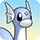 Dratini
　
 Dragonair
　
 Dragonite
</td>
  </tr>
</table>

#### Magnetic Quarry

<table class="itemListCentered">
  <tr>
    <th>Image</th>
    <th>Unlock Condition</th>
  </tr>
    <tr>
    <td rowspan="3" class="camp_background"></td>
    <td>Purchase for 700 Poke</td>
  </tr>
  <tr>
    <th>Pokemon</th>
  </tr>
  <tr>
    <td class="camp_pokemon">
 Beldum
　
 Metang
　
 Metagross
</td>
  </tr>
</table>

#### Dragon Cave

<table class="itemListCentered">
  <tr>
    <th>Image</th>
    <th>Unlock Condition</th>
  </tr>
    <tr>
    <td rowspan="3" class="camp_background"></td>
    <td>Purchase for 3000 Poke</td>
  </tr>
  <tr>
    <th>Pokemon</th>
  </tr>
  <tr>
    <td class="camp_pokemon">
 Bagon
　
 Shelgon
　
 Salamence
</td>
  </tr>
</table>

#### Aged Chamber A-N

<table class="itemListCentered">
  <tr>
    <th>Image</th>
    <th>Unlock Condition</th>
  </tr>
    <tr>
    <td rowspan="3" class="camp_background"></td>
    <td>Purchase for 9000 Poke</td>
  </tr>
  <tr>
    <th>Pokemon</th>
  </tr>
  <tr>
    <td class="camp_pokemon">
 Unown
　
 Unown
　
 Unown
　
 Unown
　
 Unown
　
 Unown
　
 Unown
</td>
    <td class="camp_pokemon">
 Unown
　
 Unown
　
 Unown
　
 Unown
　
 Unown
　
 Unown
　
 Unown
</td>
  </tr>
</table>

#### Aged Chamber O-?

<table class="itemListCentered">
  <tr>
    <th>Image</th>
    <th>Unlock Condition</th>
  </tr>
    <tr>
    <td rowspan="3" class="camp_background"></td>
    <td>Purchase for 9000 Poke</td>
  </tr>
  <tr>
    <th>Pokemon</th>
  </tr>
  <tr>
    <td class="camp_pokemon">
 Unown
　
 Unown
　
 Unown
　
 Unown
　
 Unown
　
 Unown
　
 Unown
</td>
    <td class="camp_pokemon">
 Unown
　
 Unown
　
 Unown
　
 Unown
　
 Unown
　
 Unown
　
 Unown
</td>
  </tr>
</table>

#### Ancient Relic

<table class="itemListCentered">
  <tr>
    <th>Image</th>
    <th>Unlock Condition</th>
  </tr>
    <tr>
    <td rowspan="3" class="camp_background"></td>
    <td>Purchase for 700 Poke</td>
  </tr>
  <tr>
    <th>Pokemon</th>
  </tr>
  <tr>
    <td class="camp_pokemon">
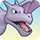 Aerodactyl
　
 Baltoy
　
 Claydol
　
 Regirock
　
 Regice
　
 Registeel
</td>
  </tr>
</table>

#### Mt. Moonview

<table class="itemListCentered">
  <tr>
    <th>Image</th>
    <th>Unlock Condition</th>
  </tr>
    <tr>
    <td rowspan="3" class="camp_background"></td>
    <td>Purchase for 7000 Poke</td>
  </tr>
  <tr>
    <th>Pokemon</th>
  </tr>
  <tr>
    <td class="camp_pokemon">
 Cleffa
　
 Clefairy
　
 Clefable
　
 Lunatone
　
 Solrock
　
 Jirachi
</td>
  </tr>
</table>

#### Darkness Ridge

<table class="itemListCentered">
  <tr>
    <th>Image</th>
    <th>Unlock Condition</th>
  </tr>
    <tr>
    <td rowspan="3" class="camp_background"></td>
    <td>Purchase for 800 Poke</td>
  </tr>
  <tr>
    <th>Pokemon</th>
  </tr>
  <tr>
    <td class="camp_pokemon">
 Vulpix
　
 Ninetales
　
 Gastly
　
 Haunter
　
 Gengar
　
 Misdreavus
　
 Mismagius
　
 Sneasel
</td>
    <td class="camp_pokemon">
 Weavile
　
 Sableye
　
 Shuppet
　
 Banette
　
 Duskull
　
 Dusclops
　
 Dusknoir
　
 Absol
</td>
  </tr>
</table>

#### Legendary Island

<table class="itemListCentered">
  <tr>
    <th>Image</th>
    <th>Unlock Condition</th>
  </tr>
    <tr>
    <td rowspan="3" class="camp_background"></td>
    <td>Recruit Articuno, Zapdos, or Moltres</td>
  </tr>
  <tr>
    <th>Pokemon</th>
  </tr>
  <tr>
    <td class="camp_pokemon">
 Articuno
　
 Zapdos
　
 Moltres
</td>
  </tr>
</table>

#### Cryptic Cave

<table class="itemListCentered">
  <tr>
    <th>Image</th>
    <th>Unlock Condition</th>
  </tr>
    <tr>
    <td rowspan="3" class="camp_background"></td>
    <td>Recruit Mewtwo</td>
  </tr>
  <tr>
    <th>Pokemon</th>
  </tr>
  <tr>
    <td class="camp_pokemon">
 Mewtwo
</td>
  </tr>
</table>

#### Final Island

<table class="itemListCentered">
  <tr>
    <th>Image</th>
    <th>Unlock Condition</th>
  </tr>
    <tr>
    <td rowspan="3" class="camp_background"></td>
    <td>Purchase for 9000 Poke (Post-game)</td>
  </tr>
  <tr>
    <th>Pokemon</th>
  </tr>
  <tr>
    <td class="camp_pokemon">
 Mew
</td>
  </tr>
</table>

#### Sacred Field

<table class="itemListCentered">
  <tr>
    <th>Image</th>
    <th>Unlock Condition</th>
  </tr>
    <tr>
    <td rowspan="3" class="camp_background"></td>
    <td>Recruit Raikou, Entei, or Suicune</td>
  </tr>
  <tr>
    <th>Pokemon</th>
  </tr>
  <tr>
    <td class="camp_pokemon">
 Raikou
　
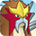 Entei
　
 Suicune
</td>
  </tr>
</table>

#### Deepsea Current

<table class="itemListCentered">
  <tr>
    <th>Image</th>
    <th>Unlock Condition</th>
  </tr>
    <tr>
    <td rowspan="3" class="camp_background"></td>
    <td>Recruit Lugia</td>
  </tr>
  <tr>
    <th>Pokemon</th>
  </tr>
  <tr>
    <td class="camp_pokemon">
 Lugia
</td>
  </tr>
</table>

#### Rainbow Peak

<table class="itemListCentered">
  <tr>
    <th>Image</th>
    <th>Unlock Condition</th>
  </tr>
    <tr>
    <td rowspan="3" class="camp_background"></td>
    <td>Recruit Ho-Oh</td>
  </tr>
  <tr>
    <th>Pokemon</th>
  </tr>
  <tr>
    <td class="camp_pokemon">
 Ho-Oh
</td>
  </tr>
</table>

#### Healing Forest

<table class="itemListCentered">
  <tr>
    <th>Image</th>
    <th>Unlock Condition</th>
  </tr>
    <tr>
    <td rowspan="3" class="camp_background"></td>
    <td>Recruit Celebi</td>
  </tr>
  <tr>
    <th>Pokemon</th>
  </tr>
  <tr>
    <td class="camp_pokemon">
 Celebi
</td>
  </tr>
</table>

#### Southern Island

<table class="itemListCentered">
  <tr>
    <th>Image</th>
    <th>Unlock Condition</th>
  </tr>
    <tr>
    <td rowspan="3" class="camp_background"></td>
    <td>Recruit Latias or Latios</td>
  </tr>
  <tr>
    <th>Pokemon</th>
  </tr>
  <tr>
    <td class="camp_pokemon">
 Latias
　
 Latios
</td>
  </tr>
</table>

#### Seafloor Cave

<table class="itemListCentered">
  <tr>
    <th>Image</th>
    <th>Unlock Condition</th>
  </tr>
    <tr>
    <td rowspan="3" class="camp_background"></td>
    <td>Recruit Kyogre</td>
  </tr>
  <tr>
    <th>Pokemon</th>
  </tr>
  <tr>
    <td class="camp_pokemon">
 Kyogre
</td>
  </tr>
</table>

#### Volcanic Pit

<table class="itemListCentered">
  <tr>
    <th>Image</th>
    <th>Unlock Condition</th>
  </tr>
    <tr>
    <td rowspan="3" class="camp_background"></td>
    <td>Recruit Groudon</td>
  </tr>
  <tr>
    <th>Pokemon</th>
  </tr>
  <tr>
    <td class="camp_pokemon">
 Groudon
</td>
  </tr>
</table>

#### Stratos Lookout

<table class="itemListCentered">
  <tr>
    <th>Image</th>
    <th>Unlock Condition</th>
  </tr>
    <tr>
    <td rowspan="3" class="camp_background"></td>
    <td>Recruit Rayquaza</td>
  </tr>
  <tr>
    <th>Pokemon</th>
  </tr>
  <tr>
    <td class="camp_pokemon">
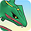 Rayquaza
</td>
  </tr>
</table>

#### Enclosed Island

<table class="itemListCentered">
  <tr>
    <th>Image</th>
    <th>Unlock Condition</th>
  </tr>
    <tr>
    <td rowspan="3" class="camp_background">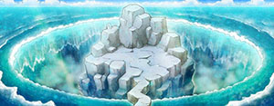</td>
    <td>Recruit Deoxys</td>
  </tr>
  <tr>
    <th>Pokemon</th>
  </tr>
  <tr>
    <td class="camp_pokemon">
 Deoxys
</td>
  </tr>
</table>
