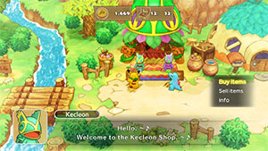

  

This is the central village of the game.

# Kecleon Shop

  

Kecleon Shop is an item shop that changes merchandise every day. Highly recommended to buy any Escape Orbs and Tiny Reviver Seeds you see.

#### Possible Items

Item Colors = After Fugitive Arc, After Murky Cave

<table class="priceTableMedium">
  <tr>
    <th>Item</th>
    <th>Price</th>
    <th rowspan="12" class="tableDivider"></th>
    <th>Item</th>
    <th>Price</th>
    <th rowspan="12" class="tableDivider"></th>
    <th>Item</th>
    <th>Price</th>
  </tr>
  <tr>
    <td>Gravelerock</td>
    <td>10</td>
    <td>Totter Seed</td>
    <td>12</td>
    <td>Escape Orb</td>
    <td>300</td>
  </tr>
  <tr>
    <td>Apple</td>
    <td>50</td>
    <td>Warp Seed</td>
    <td>25</td>
    <td>One-Shot Orb</td>
    <td>80</td>
  </tr>
  <tr>
    <td>Max Ether</td>
    <td>100</td>
    <td>Protein</td>
    <td>2000</td>
    <td>Helper Orb</td>
    <td>50</td>
  </tr>
  <tr>
    <td>Max Elixir</td>
    <td>175</td>
    <td>Iron</td>
    <td>2000</td>
    <td>Inviting Orb</td>
    <td>150</td>
  </tr>
  <tr>
    <td>Oran Berry</td>
    <td>25</td>
    <td>Calcium</td>
    <td>2000</td>
    <td>Health Orb</td>
    <td>100</td>
  </tr>
  <tr>
    <td>Cheri Berry</td>
    <td>12</td>
    <td>Zinc</td>
    <td>2000</td>
    <td>Rare Quality Orb</td>
    <td>100</td>
  </tr>
  <tr>
    <td>Pecha Berry</td>
    <td>12</td>
    <td>Carbos</td>
    <td>2000</td>
    <td>Mobile Orb</td>
    <td>200</td>
  </tr>
  <tr>
    <td>Life Seed</td>
    <td>5000</td>
    <td>Power Drink</td>
    <td>5000</td>
    <td>Reset Orb</td>
    <td>300</td>
  </tr>
  <tr>
    <td>Sleep Seed</td>
    <td>15</td>
    <td>Accuracy Drink</td>
    <td>5000</td>
    <td>Invitation</td>
    <td>1000</td>
  </tr>
  <tr>
    <td>Blast Seed</td>
    <td>30</td>
    <td>PP-Up Drink</td>
    <td>5000</td>
    <td rowspan="2" colspan="2"></td>
  </tr>
  <tr>
    <td>Tiny Reviver Seed</td>
    <td>200</td>
    <td>Rollcall Orb</td>
    <td>25</td>
  </tr>
</table>

# Kecleon Wares

  

Kecleon Wares is a TM shop that changes merchandise every day. Some TMs like Waterfall, Blizzard, Surf, Fly, and Sky Drop appear less frequently.

#### Possible TMs

<table class="priceTableMedium">
  <tr>
    <th>Item</th>
    <th>Price</th>
    <th rowspan="20" class="tableDivider"></th>
    <th>Item</th>
    <th>Price</th>
    <th rowspan="20" class="tableDivider"></th>
    <th>Item</th>
    <th>Price</th>
  </tr>
  <tr>
    <td>Acrobatics</td>
    <td>1750</td>
    <td>Fly</td>
    <td>1850</td>
    <td>Sky Drop</td>
    <td>1600</td>
  </tr>
  <tr>
    <td>Aerial Ace</td>
    <td>1800</td>
    <td>Focus Blast</td>
    <td>2500</td>
    <td>Sludge Bomb</td>
    <td>2200</td>
  </tr>
  <tr>
    <td>Blizzard</td>
    <td>3000</td>
    <td>Frost Breath</td>
    <td>1750</td>
    <td>Sludge Wave</td>
    <td>2100</td>
  </tr>
  <tr>
    <td>Brick Break</td>
    <td>1850</td>
    <td>Giga Impact</td>
    <td>2400</td>
    <td>Smack Down</td>
    <td>1700</td>
  </tr>
  <tr>
    <td>Brutal Swing</td>
    <td>1750</td>
    <td>Grass Knot</td>
    <td>1860</td>
    <td>Smart Strike</td>
    <td>1750</td>
  </tr>
  <tr>
    <td>Bulldoze</td>
    <td>2050</td>
    <td>Gyro Ball</td>
    <td>1550</td>
    <td>Snarl</td>
    <td>2550</td>
  </tr>
  <tr>
    <td>Charge Beam</td>
    <td>1950</td>
    <td>Hyper Beam</td>
    <td>2550</td>
    <td>Solar Beam</td>
    <td>2100</td>
  </tr>
  <tr>
    <td>Dark Pulse</td>
    <td>2000</td>
    <td>Ice Beam</td>
    <td>2450</td>
    <td>Steel Wing</td>
    <td>1900</td>
  </tr>
  <tr>
    <td>Dazzling Gleam</td>
    <td>2000</td>
    <td>Leech Life</td>
    <td>1750</td>
    <td>Stone Edge</td>
    <td>1950</td>
  </tr>
  <tr>
    <td>Dragon Claw</td>
    <td>1700</td>
    <td>Low Sweep</td>
    <td>1700</td>
    <td>Surf</td>
    <td>2000</td>
  </tr>
  <tr>
    <td>Dragon Tail</td>
    <td>1850</td>
    <td>Overheat</td>
    <td>2250</td>
    <td>Thunder</td>
    <td>2150</td>
  </tr>
  <tr>
    <td>Earthquake</td>
    <td>1950</td>
    <td>Poison Jab</td>
    <td>1800</td>
    <td>Thunderbolt</td>
    <td>2200</td>
  </tr>
  <tr>
    <td>Energy Ball</td>
    <td>2250</td>
    <td>Psychic</td>
    <td>1900</td>
    <td>U-turn</td>
    <td>1650</td>
  </tr>
  <tr>
    <td>Facade</td>
    <td>2400</td>
    <td>Psyshock</td>
    <td>1700</td>
    <td>Volt Switch</td>
    <td>1550</td>
  </tr>
  <tr>
    <td>False Swipe</td>
    <td>1500</td>
    <td>Rock Slide</td>
    <td>2000</td>
    <td>Waterfall</td>
    <td>1800</td>
  </tr>
  <tr>
    <td>Fire Blast</td>
    <td>2300</td>
    <td>Rock Tomb</td>
    <td>1900</td>
    <td>Wild Charge</td>
    <td>1700</td>
  </tr>
  <tr>
    <td>Flame Charge</td>
    <td>1700</td>
    <td>Scald</td>
    <td>1900</td>
    <td>X-Scissor</td>
    <td>1800</td>
  </tr>
  <tr>
    <td>Flamethrower</td>
    <td>2300</td>
    <td>Shadow Ball</td>
    <td>2300</td>
    <td rowspan="2" colspan="2"></td>
  </tr>
  <tr>
    <td>Flash Cannon</td>
    <td>1700</td>
    <td>Shadow Claw</td>
    <td>1900</td>
  </tr>
</table>

# Storage

  

Store up to 999 of each item in the game (stored items aren't lost if you faint). Treasure Box, Rescue Job, and Wish rewards automatically get sent to this storage.

# Felicity Bank

  

Store up to 9,999,999 Poke (stored Poke isn't lost if you faint). You can get 1 random free item per day by moving Poke into or out of your account.

#### Possible Daily Item

<table class="priceTableMedium">
  <tr>
    <th>Item</th>
  </tr>
  <tr>
    <td>Apple</td>
  </tr>
  <tr>
    <td>Max Ether</td>
  </tr>
  <tr>
    <td>Oran Berry</td>
  </tr>
  <tr>
    <td>Tiny Reviver Seed</td>
  </tr>
</table>

# Camp Corner

  

Shop where you purchase camps so that you can recruit specific pokemon to your team. You can get a 20% discount if you have the Bargain Rare Quality and use a Wigglytuff Orb in a dungeon. (See [Camps](/system/camps) for details)

#### Camp Corner List

Camp Colors = Available post-game.

<table class="priceTableMedium">
  <tr>
    <th>Camp</th>
    <th>Price</th>
    <th rowspan="17" class="tableDivider"></th>
    <th>Camp</th>
    <th>Price</th>
    <th rowspan="17" class="tableDivider"></th>
    <th>Camp</th>
    <th>Price</th>
  </tr>
  <tr>
    <td>Wild Plains</td>
    <td>-</td>
    <td>Safari</td>
    <td>600</td>
    <td>Treasure Sea</td>
    <td>9000</td>
  </tr>
  <tr>
    <td>Sky-Blue Plains</td>
    <td>-</td>
    <td>Withering Desert</td>
    <td>900</td>
    <td>Deepsea Floor</td>
    <td>9000</td>
  </tr>
  <tr>
    <td>Beau Plains</td>
    <td>2700</td>
    <td>Ravaged Field</td>
    <td>700</td>
    <td>Decrepit Lab</td>
    <td>6000</td>
  </tr>
  <tr>
    <td>Thunder Crag</td>
    <td>600</td>
    <td>Scorched Plains</td>
    <td>700</td>
    <td>Waterfall Lake</td>
    <td>9000</td>
  </tr>
  <tr>
    <td>Power Plant</td>
    <td>-</td>
    <td>Crater</td>
    <td>5000</td>
    <td>Evolution Forest</td>
    <td>9000</td>
  </tr>
  <tr>
    <td>Mt. Discipline</td>
    <td>700</td>
    <td>Echo Cave</td>
    <td>2700</td>
    <td>Mystic Lake</td>
    <td>2500</td>
  </tr>
  <tr>
    <td>Mt. Green</td>
    <td>700</td>
    <td>Boulder Cave</td>
    <td>700</td>
    <td>Magnetic Quarry</td>
    <td>700</td>
  </tr>
  <tr>
    <td>Mt. Cleft</td>
    <td>700</td>
    <td>Frigid Cavern</td>
    <td>800</td>
    <td>Dragon Cave</td>
    <td>3000</td>
  </tr>
  <tr>
    <td>Stump Forest</td>
    <td>-</td>
    <td>Tadpole Pond</td>
    <td>900</td>
    <td>Aged Chamber A-N</td>
    <td>9000</td>
  </tr>
  <tr>
    <td>Flyaway Forest</td>
    <td>500</td>
    <td>Turtleshell Pond</td>
    <td>6000</td>
    <td>Aged Chamber O-?</td>
    <td>9000</td>
  </tr>
  <tr>
    <td>Secretive Forest</td>
    <td>900</td>
    <td>Rub-a-Dub River</td>
    <td>3000</td>
    <td>Ancient Relic</td>
    <td>700</td>
  </tr>
  <tr>
    <td>Vibrant Forest</td>
    <td>800</td>
    <td>Gourd Swamp</td>
    <td>9000</td>
    <td>Mt. Moonview</td>
    <td>7000</td>
  </tr>
  <tr>
    <td>Mushroom Forest</td>
    <td>800</td>
    <td>Ice Floe Beach</td>
    <td>6000</td>
    <td>Darkness Ridge</td>
    <td>800</td>
  </tr>
  <tr>
    <td>Overgrown Forest</td>
    <td>700</td>
    <td>Shallow Beach</td>
    <td>9000</td>
    <td>Final Island</td>
    <td>9000</td>
  </tr>
  <tr>
    <td>Jungle</td>
    <td>500</td>
    <td>Bountiful Sea</td>
    <td>9000</td>
    <td rowspan="2" colspan="2"></td>
  </tr>
  <tr>
    <td>Poison Swamp</td>
    <td>7000</td>
    <td>Serene Sea</td>
    <td>9000</td>
  </tr>
</table>

# Link Shop

  

Link or delink moves, relearn level-up moves, or be taught new moves (post-game). You can also change which button moves are assigned to here.

- Linking, delinking, and relearning moves is free.
- Relearning moves only applies to moves learned via leveling up (pre-evolution included).
    - To be clear, you can't relearn TM or taught moves that you decided to forget.

#### Tutor Moves (Post-Game)

<table class="priceTableMedium">
  <tr>
    <th>Move</th>
    <th>Type</th>
    <th>Category</th>
    <th>Price</th>
    <td rowspan="39" class="tableDivider"></td>
    <th>Move</th>
    <th>Type</th>
    <th>Category</th>
    <th>Price</th>
  </tr>
  <tr>
    <td>After You</td>
    <td>Normal</td>
    <td class="status">Status</td>
    <td>8000</td>
    <td>Iron Tail</td>
    <td>Steel</td>
    <td class="physical">Physical</td>
    <td>9000</td>
  </tr>
  <tr>
    <td>Ally Switch</td>
    <td>Psychic</td>
    <td class="status">Status</td>
    <td>10000</td>
    <td>Knock Off</td>
    <td>Dark</td>
    <td class="physical">Physical</td>
    <td>7000</td>
  </tr>
  <tr>
    <td>Aqua Tail</td>
    <td>Water</td>
    <td class="physical">Physical</td>
    <td>8000</td>
    <td>Laser Focus</td>
    <td>Normal</td>
    <td class="status">Status</td>
    <td>10000</td>
  </tr>
  <tr>
    <td>Bind</td>
    <td>Normal</td>
    <td class="physical">Physical</td>
    <td>7000</td>
    <td>Last Resort</td>
    <td>Normal</td>
    <td class="physical">Physical</td>
    <td>7000</td>
  </tr>
  <tr>
    <td>Blast Burn</td>
    <td>Fire</td>
    <td class="special">Special</td>
    <td>11000</td>
    <td>Liquidation</td>
    <td>Water</td>
    <td class="physical">Physical</td>
    <td>10000</td>
  </tr>
  <tr>
    <td>Block</td>
    <td>Normal</td>
    <td class="status">Status</td>
    <td>7000</td>
    <td>Low Kick</td>
    <td>Fighting</td>
    <td class="physical">Physical</td>
    <td>7000</td>
  </tr>
  <tr>
    <td>Bounce</td>
    <td>Flying</td>
    <td class="physical">Physical</td>
    <td>8000</td>
    <td>Magic Coat</td>
    <td>Psychic</td>
    <td class="status">Status</td>
    <td>8000</td>
  </tr>
  <tr>
    <td>Bug Bite</td>
    <td>Bug</td>
    <td class="physical">Physical</td>
    <td>7000</td>
    <td>Magic Room</td>
    <td>Psychic</td>
    <td class="status">Status</td>
    <td>8000</td>
  </tr>
  <tr>
    <td>Covet</td>
    <td>Normal</td>
    <td class="physical">Physical</td>
    <td>7000</td>
    <td>Magnet Rise</td>
    <td>Electric</td>
    <td class="status">Status</td>
    <td>8000</td>
  </tr>
  <tr>
    <td>Defog</td>
    <td>Flying</td>
    <td class="status">Status</td>
    <td>10000</td>
    <td>Outrage</td>
    <td>Dragon</td>
    <td class="physical">Physical</td>
    <td>7000</td>
  </tr>
  <tr>
    <td>Draco Meteor</td>
    <td>Dragon</td>
    <td class="special">Special</td>
    <td>11000</td>
    <td>Pain Split</td>
    <td>Normal</td>
    <td class="status">Status</td>
    <td>7000</td>
  </tr>
  <tr>
    <td>Dragon Ascent</td>
    <td>Flying</td>
    <td class="physical">Physical</td>
    <td>7000</td>
    <td>Recycle</td>
    <td>Normal</td>
    <td class="status">Status</td>
    <td>8000</td>
  </tr>
  <tr>
    <td>Dragon Pulse</td>
    <td>Dragon</td>
    <td class="special">Special</td>
    <td>9000</td>
    <td>Role Play</td>
    <td>Psychic</td>
    <td class="status">Status</td>
    <td>7000</td>
  </tr>
  <tr>
    <td>Drain Punch</td>
    <td>Fighting</td>
    <td class="physical">Physical</td>
    <td>8000</td>
    <td>Seed Bomb</td>
    <td>Grass</td>
    <td class="physical">Physical</td>
    <td>9000</td>
  </tr>
  <tr>
    <td>Drill Run</td>
    <td>Ground</td>
    <td class="physical">Physical</td>
    <td>8000</td>
    <td>Shock Wave</td>
    <td>Electric</td>
    <td class="special">Special</td>
    <td>8000</td>
  </tr>
  <tr>
    <td>Dual Chop</td>
    <td>Dragon</td>
    <td class="physical">Physical</td>
    <td>7000</td>
    <td>Signal Beam</td>
    <td>Bug</td>
    <td class="special">Special</td>
    <td>9000</td>
  </tr>
  <tr>
    <td>Earth Power</td>
    <td>Ground</td>
    <td class="special">Special</td>
    <td>10000</td>
    <td>Skill Swap</td>
    <td>Psychic</td>
    <td class="status">Status</td>
    <td>8000</td>
  </tr>
  <tr>
    <td>Electroweb</td>
    <td>Electric</td>
    <td class="special">Special</td>
    <td>8000</td>
    <td>Sky Attack</td>
    <td>Flying</td>
    <td class="physical">Physical</td>
    <td>8000</td>
  </tr>
  <tr>
    <td>Endeavor</td>
    <td>Normal</td>
    <td class="physical">Physical</td>
    <td>7000</td>
    <td>Snatch</td>
    <td>Dark</td>
    <td class="status">Status</td>
    <td>8000</td>
  </tr>
  <tr>
    <td>Fire Pledge</td>
    <td>Fire</td>
    <td class="special">Special</td>
    <td>7000</td>
    <td>Snore</td>
    <td>Normal</td>
    <td class="special">Special</td>
    <td>9000</td>
  </tr>
  <tr>
    <td>Fire Punch</td>
    <td>Fire</td>
    <td class="physical">Physical</td>
    <td>8000</td>
    <td>Spite</td>
    <td>Ghost</td>
    <td class="status">Status</td>
    <td>7000</td>
  </tr>
  <tr>
    <td>Focus Punch</td>
    <td>Fighting</td>
    <td class="physical">Physical</td>
    <td>8000</td>
    <td>Stealth Rock</td>
    <td>Rock</td>
    <td class="status">Status</td>
    <td>8000</td>
  </tr>
  <tr>
    <td>Foul Play</td>
    <td>Dark</td>
    <td class="physical">Physical</td>
    <td>9000</td>
    <td>Stomping Tantrum</td>
    <td>Ground</td>
    <td class="physical">Physical</td>
    <td>10000</td>
  </tr>
  <tr>
    <td>Frenzy Plant</td>
    <td>Grass</td>
    <td class="special">Special</td>
    <td>11000</td>
    <td>Super Fang</td>
    <td>Normal</td>
    <td class="physical">Physical</td>
    <td>7000</td>
  </tr>
  <tr>
    <td>Gastro Acid</td>
    <td>Poison</td>
    <td class="status">Status</td>
    <td>8000</td>
    <td>Superpower</td>
    <td>Fighting</td>
    <td class="physical">Physical</td>
    <td>10000</td>
  </tr>
  <tr>
    <td>Giga Drain</td>
    <td>Grass</td>
    <td class="special">Special</td>
    <td>8000</td>
    <td>Synthesis</td>
    <td>Grass</td>
    <td class="status">Status</td>
    <td>8000</td>
  </tr>
  <tr>
    <td>Grass Pledge</td>
    <td>Grass</td>
    <td class="special">Special</td>
    <td>7000</td>
    <td>Tailwind</td>
    <td>Flying</td>
    <td class="status">Status</td>
    <td>8000</td>
  </tr>
  <tr>
    <td>Gravity</td>
    <td>Psychic</td>
    <td class="status">Status</td>
    <td>8000</td>
    <td>Telekinesis</td>
    <td>Psychic</td>
    <td class="status">Status</td>
    <td>10000</td>
  </tr>
  <tr>
    <td>Gunk Shot</td>
    <td>Poison</td>
    <td class="physical">Physical</td>
    <td>12000</td>
    <td>Throat Chop</td>
    <td>Dark</td>
    <td class="physical">Physical</td>
    <td>10000</td>
  </tr>
  <tr>
    <td>Heal Bell</td>
    <td>Normal</td>
    <td class="status">Status</td>
    <td>8000</td>
    <td>Thunder Punch</td>
    <td>Electric</td>
    <td class="physical">Physical</td>
    <td>8000</td>
  </tr>
  <tr>
    <td>Heat Wave</td>
    <td>Fire</td>
    <td class="special">Special</td>
    <td>10000</td>
    <td>Trick</td>
    <td>Psychic</td>
    <td class="status">Status</td>
    <td>7000</td>
  </tr>
  <tr>
    <td>Helping Hand</td>
    <td>Normal</td>
    <td class="status">Status</td>
    <td>8000</td>
    <td>Uproar</td>
    <td>Normal</td>
    <td class="special">Special</td>
    <td>8000</td>
  </tr>
  <tr>
    <td>Hydro Cannon</td>
    <td>Water</td>
    <td class="special">Special</td>
    <td>11000</td>
    <td>Volt Tackle</td>
    <td>Electric</td>
    <td class="physical">Physical</td>
    <td>11000</td>
  </tr>
  <tr>
    <td>Hyper Voice</td>
    <td>Normal</td>
    <td class="special">Special</td>
    <td>9000</td>
    <td>Water Pledge</td>
    <td>Water</td>
    <td class="special">Special</td>
    <td>7000</td>
  </tr>
  <tr>
    <td>Ice Punch</td>
    <td>Ice</td>
    <td class="physical">Physical</td>
    <td>8000</td>
    <td>Water Pulse</td>
    <td>Water</td>
    <td class="special">Special</td>
    <td>9000</td>
  </tr>
  <tr>
    <td>Icy Wind</td>
    <td>Ice</td>
    <td class="special">Special</td>
    <td>9000</td>
    <td>Wonder Room</td>
    <td>Psychic</td>
    <td class="status">Status</td>
    <td>8000</td>
  </tr>
  <tr>
    <td>Iron Defense</td>
    <td>Steel</td>
    <td class="status">Status</td>
    <td>8000</td>
    <td>Worry Seed</td>
    <td>Grass</td>
    <td class="status">Status</td>
    <td>9000</td>
  </tr>
  <tr>
    <td>Iron Head</td>
    <td>Steel</td>
    <td class="physical">Physical</td>
    <td>8000</td>
    <td>Zen Headbutt</td>
    <td>Psychic</td>
    <td class="physical">Physical</td>
    <td>8000</td>
  </tr>
</table>

# Post Office

  

This is where you go to take on rescue jobs for various rewards. The amount of rescue points and Poke you earn from a rescue job depends on difficulty and depth. The values from the difficulty and depth tables are added together for the total reward amount. Quantity of items also increases based on depth.

##### Difficulty (Rescue Points + Poke)

<table class="">
  <tr>
    <th>Difficulty</th>
    <th>F</th>
    <th>E</th>
    <th>D</th>
    <th>C</th>
    <th>B</th>
    <th>A</th>
    <th>S</th>
    <th>★</th>
    <th>★★</th>
    <th>★★★</th>
  </tr>
  <tr>
    <th>Points</th>
    <td>50</td>
    <td>60</td>
    <td>75</td>
    <td>100</td>
    <td>125</td>
    <td>150</td>
    <td>175</td>
    <td>200</td>
    <td>225</td>
    <td>250</td>
  </tr>
  <tr>
    <th>Poke</th>
    <td>100</td>
    <td>150</td>
    <td>200</td>
    <td>300</td>
    <td>400</td>
    <td>500</td>
    <td>600</td>
    <td>700</td>
    <td>800</td>
    <td>1000</td>
  </tr>
</table>

##### Depth (Item Quantity + Rescue Points + Poke)

<table class="">
  <tr>
    <th>Depth</th>
    <th>1-9F</th>
    <th>10-19F</th>
    <th>20-29F</th>
    <th>30-39F</th>
    <th>40-49F</th>
    <th>50-59F</th>
    <th>60-69F</th>
    <th>70-79F</th>
    <th>80-89F</th>
    <th>90-99F</th>
  </tr>
  <tr>
    <th>Item Qty</th>
    <td>1</td>
    <td>2</td>
    <td>3</td>
    <td>4</td>
    <td>5</td>
    <td>6</td>
    <td>7</td>
    <td>8</td>
    <td>9</td>
    <td>10</td>
  </tr>
  <tr>
    <th>Points</th>
    <td>0</td>
    <td>100</td>
    <td>130</td>
    <td>230</td>
    <td>400</td>
    <td>640</td>
    <td>940</td>
    <td>1250</td>
    <td>1350</td>
    <td>1450</td>
  </tr>
  <tr>
    <th>Poke</th>
    <td>0</td>
    <td>200</td>
    <td>320</td>
    <td>450</td>
    <td>650</td>
    <td>1090</td>
    <td>1640</td>
    <td>2300</td>
    <td>2800</td>
    <td>3100</td>
  </tr>
</table>

#### Bulletin Board

Available after clearing Thunderwave Cave, but rescue points can't be earned until Mt. Steel is completed. The target depth is never deeper than 30F for any dungeon for Bulletin Board jobs.

##### Possible Rewards

|Equipment|Food/Seed|Drink/Vitamin|Orb/Other|
|-|-|-|-|
|Cover Band|Perfect Apple|Max Elixir|All Protect Orb|
|Defense Scarf|Sitrus Berry|Protein|Bank Orb|
|Detect Band|Pecha Berry|Iron|Helper Orb|
|Efficient Bandanna|Ban Seed|Calcium|Rare Quality Orb|
|Explosive Band|Blast Seed|Zinc|Reset Orb|
|Fickle Specs|Decoy Seed|Carbos|See-Trap Orb|
|Fierce Bandanna|Empowerment Seed|Power Drink|Storage Orb|
|Gold Ribbon|Energy Seed|Accuracy Drink|Trapbust Orb|
|Heal Ribbon|Life Seed|PP-Up Drink|Weather Lock Orb|
|Heavy Rotation Specs|Pure Seed|Rainbow Gummi|Wigglytuff Orb|
|Insomniscope|Reviver Seed||Bronze Dojo Ticket|
|Joy Ribbon|Sleep Seed||Silver Dojo Ticket|
|Lucky Ribbon|Stun Seed||Gold Dojo Ticket|
|Pass Scarf|Tiny Reviver Seed|||
|Pecha Scarf|Training Seed|||
|Persim Band|Violent Seed|||
|Power Band||||
|Scope Lens||||
|Special Band||||
|Stamina Band||||
|Twist Band||||
|Warp Scarf||||
|Zinc Band||||

#### Pelipper Post Office (Friend Rescue)

##### Possible Rewards

|Item|Regular|Special|Deluxe|
|-|-|-|-|
|Big Apple|●|||
|Max Elixir|●|||
|Reviver Seed|●|||
|Gold Ribbon|●|●||
|One-Room Orb|?|●||
|Helper Orb|●|●||
|Storage Orb|●|●||
|Revive All Orb|●|●||
|All Protect Orb|●|●||
|Reset Orb|●|●||
|Sitrus Berry|●|●|●|
|Life Seed|●|●|●|
|Protein|●|●|●|
|Iron|●|●|●|
|Calcium|●|●|●|
|Zinc|●|●|●|
|Carbos|●|●|●|
|Power Drink|●|●|●|
|Accuracy Drink|●|●|●|
|PP-Up Drink|●|●|●|
|Rainbow Gummi|●|●|●|
|DX Gummi|?|?|●|

#### Statues

Statues earned as rewards from increasing Team Rank are visible near the Bulletin Board. Having a statue of a pokemon makes it so that you can encounter that pokemon in a dungeon. The 4 available statues are Bonsly, Mime Jr., Weavile, and Lucario. (See [Team Rank](/system/rescue-team#team-rank) for point requirements)

# Makuhita Dojo

  

#### Dojo Drills

Facility where you spend Dojo Tickets to rapidly level up 1 Pokemon along with its moves. Experience points earned during a dojo drill DOES NOT get shared with any other Pokemon.

|Ticket|Time|Exp per enemy|Move Exp.|
|-|-|-|-|
|Bronze|50 seconds|Roughly level x 6|x3.0|
|Silver|55 seconds|Roughly level x 12|x5.0|
|Gold|60 seconds|Roughly level x 18|x7.0|

##### Experience Points

- Exp = (Level x 6 + Species) x (1 + Ticket + SE) x (1 + RQ) 　
    - Level → Level you entered the dojo (Lv100 is treated as Lv99)
    - Species → 2 or 4 or 6 (See enemy species values table below)
    - Ticket → 0 or 1 or 2 (Bronze = 0, Silver = 1, Gold = 2)
    - SE → 0 or 0.5 (Defeated using super-effective move = 0.5, any other move = 0)
    - RQ → 0 or 1 (XP Boost = 1, all other Rare Qualities = 0)

##### Enemy Species Values

|Type|2|4|6|
|-|-|-|-|
|Normal|Beedrill|Shelgon|Kingler|
|Fighting|Sentret|Raticate|Vigoroth|
|Ground|Omanyte|Kabutops|Mawile|
|Poison|Togekiss|Marill|Ludicolo|
|Flying|Surskit|Hitmonlee|Scyther|
|Rock|Anorith|Taillow|Scyther|
|Bug|Girafarig|Crawdaunt|Lotad|
|Ghost|Beldum|Mr. Mime|Gallade|
|Steel|Azurill|Mr. Mime|Armaldo|
|Fire|Weedle|Mawile|Scizor|
|Water|Phanpy|Armaldo|Gligar|
|Grass|Corphish|Omanyte|Kabutops|
|Electric|Marill|Surskit|Crawdaunt|
|Psychic|Tyrogue|Beedrill|Heracross|
|Ice|Farfetch'd|Togekiss|Gligar|
|Dragon|Bagon|Shelgon|Salamence|
|Dark|Beldum|Girafarig|Wobbuffet|
|Fairy|Bagon|Hitmontop|Heracross|

#### Tricks of the Trade

Tutorial facility that offers rewards for completing a topic for the first time.

|Tutorial|Reward|
|-|-|
|Use moves!|Apple x 4|
|Dash through the dungeon!|Reviver Seed x 3|
|Push a Pokemon!|Escape Orb x 5|
|Pass by a teammate!|Gold Ribbon x 1|
|Change directions without moving!|Max Elixir x 4|
|Use items!|Bronze Dojo Ticket x 3|
|Moving diagonally!|Slumber Wand x 10|

# Luminous Cave

  

This is where you go to evolve pokemon (post-game). A pokemon must meet the level and/or item requirements before it can evolve.

- Each time a Pokemon evolves, it gains +10 HP and +3 to all other stats.

# Munchlax

  

Rarely appears after finishing the fugitive arc of the main story (walks from right to left). Talk to Munchlax before they leave the screen to see 1 of 2 random events and obtain a reward.

- Event 1 - Hungry Munchlax
    - Munchlax gives you an item as thanks if you give them food (not Grimy Food).
- Event 2 - Munchlax drops apples
    - Munchlax gives you an item as thanks if you pick up and return the apples to them.

#### Possible Rewards

<table class="priceTableMedium">
  <tr>
    <th>Item</th>
  </tr>
  <tr>
    <td>Big Eater Belt</td>
  </tr>
  <tr>
    <td>Munch Belt</td>
  </tr>
  <tr>
    <td>Tight Belt</td>
  </tr>
  <tr>
    <td>Reviver Seed</td>
  </tr>
  <tr>
    <td>Rainbow Gummi</td>
  </tr>
  <tr>
    <td>DX Gummi</td>
  </tr>
  <tr>
    <td>Bronze Dojo Ticket</td>
  </tr>
  <tr>
    <td>Silver Dojo Ticket</td>
  </tr>
  <tr>
    <td>Gold Dojo Ticket</td>
  </tr>
</table>
