# Team Rank

# Team Base

#### Initial

##### Interior

[Images]

##### Exterior

[Images]

#### Renovation

Requires 3 Chestnuts from Uproar Forest (After clearing Uproar Forest for the first time).

##### Interior

<table class="baseTable">
  <tr>
    <th>Grass</th>
    <th>Fire</th>
    <th>Water</th>
    <th>Other 1</th>
    <th>Other 2</th>
  </tr>
  <tr>
    <td>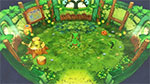</td>
    <td>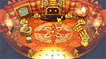</td>
    <td>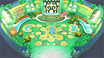</td>
    <td>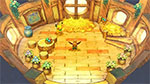</td>
    <td>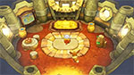</td>
  </tr>
</table>

※ Other 1 - Pikachu, Meowth, Eevee, Skitty ※ Other 2 - Machop, Cubone

##### Exterior

<table class="baseTable">
  <tr>
    <th>Bulbasaur</th>
    <th>Charmander</th>
    <th>Squirtle</th>
    <th>Pikachu</th>
  </tr>
  <tr>
    <td>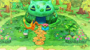</td>
    <td>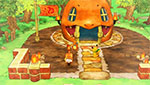</td>
    <td>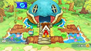</td>
    <td>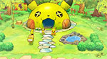</td>
  </tr>
  <tr>
    <th>Meowth</th>
    <th>Psyduck</th>
    <th>Machop</th>
    <th>Cubone</th>
  </tr>
  <tr>
    <td>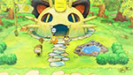</td>
    <td>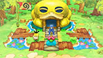</td>
    <td>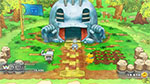</td>
    <td>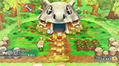</td>
  </tr>
  <tr>
    <th>Eevee</th>
    <th>Chikorita</th>
    <th>Cyndaquil</th>
    <th>Totodile</th>
  </tr>
  <tr>
    <td>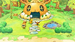</td>
    <td>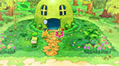</td>
    <td>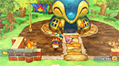</td>
    <td>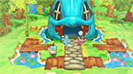</td>
  </tr>
  <tr>
    <th>Treecko</th>
    <th>Torchic</th>
    <th>Mudkip</th>
    <th>Skitty</th>
  </tr>
  <tr>
    <td>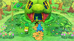</td>
    <td>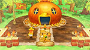</td>
    <td>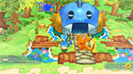</td>
    <td>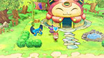</td>
  </tr>
</table>

#### Flag

Requires finishing Smeargle's request (After clearing Howling Forest). ※ Available designs vary based on starter.

##### Designs

<table class="baseTable">
  <tr>
    <td>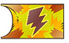</td>
    <td>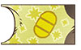</td>
    <td>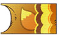</td>
    <td>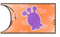</td>
    <td>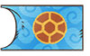</td>
    <td>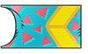</td>
    <td>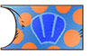</td>
  </tr>
  <tr>
    <td>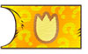</td>
    <td>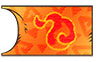</td>
    <td>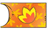</td>
    <td>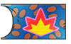</td>
    <td>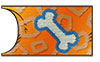</td>
    <td></td>
    <td>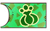</td>
  </tr>
  <tr>
    <td>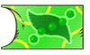</td>
    <td></td>
    <td>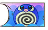</td>
    <td>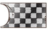</td>
    <td>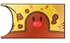</td>
    <td>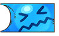</td>
    <td>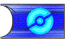</td>
  </tr>
  <tr>
    <td></td>
    <td>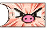</td>
    <td>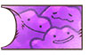</td>
    <td>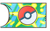</td>
    <td>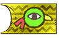</td>
    <td>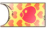</td>
    <td>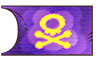</td>
  </tr>
  <tr>
    <td>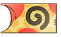</td>
    <td></td>
    <td>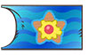</td>
    <td></td>
    <td></td>
    <td></td>
    <td></td>
  </tr>
</table>
