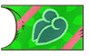
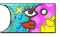
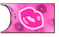

# Team Rank

<table class="rankTable">
  <tr>
    <th>Image</th>
    <th>Rank</th>
    <th>Total Points</th>
    <th>Camp Size</th>
    <th>Job Count</th>
    <th>Saved Teams</th>
    <th>Toolbox Size</th>
    <th>Rank Up Rewards</th>
  </tr>
  <tr>
    <td></td>
    <td>Rookie</td>
    <td>-</td>
    <td>5</td>
    <td>8</td>
    <td>2</td>
    <td>32</td>
    <td>-</td>
  </tr>
  <tr>
    <td></td>
    <td>Normal</td>
    <td>400</td>
    <td>8</td>
    <td>16</td>
    <td>3</td>
    <td>32</td>
    <td>Max Elixir x 10 Accuracy Drink x 5 Silver Dojo Ticket x 5</td>
  </tr>
  <tr>
    <td></td>
    <td>Bronze</td>
    <td>1100</td>
    <td>11</td>
    <td>24</td>
    <td>4</td>
    <td>40</td>
    <td>Bonsly Statue Max Elixir x 10 PP-Up Drink x 5 Gold Dojo Ticket x 5</td>
  </tr>
  <tr>
    <td></td>
    <td>Silver</td>
    <td>2200</td>
    <td>14</td>
    <td>32</td>
    <td>5</td>
    <td>48</td>
    <td>Max Elixir x 15 Power Drink x 8 Revive All Orb x 5</td>
  </tr>
  <tr>
    <td></td>
    <td>Gold</td>
    <td>5200</td>
    <td>20</td>
    <td>40</td>
    <td>6</td>
    <td>48</td>
    <td>Mime Jr. Statue Rainbow Gummi x 5 Accuracy Drink x 10 X-Ray Specs x 1</td>
  </tr>
  <tr>
    <td></td>
    <td>Platinum</td>
    <td>11200</td>
    <td>23</td>
    <td>48</td>
    <td>7</td>
    <td>48</td>
    <td>Rainbow Gummi x 10 PP-Up Drink x 10 Sitrus Berry x 12</td>
  </tr>
  <tr>
    <td></td>
    <td>Diamond</td>
    <td>19200</td>
    <td>26</td>
    <td>56</td>
    <td>7</td>
    <td>48</td>
    <td>Weavile Statue DX Gummi x 3 Power Drink x 13 Revive All Orb x 10</td>
  </tr>
  <tr>
    <td></td>
    <td>Ace</td>
    <td>27800</td>
    <td>29</td>
    <td>64</td>
    <td>8</td>
    <td>48</td>
    <td>DX Gummi x 3 Protein x 12 Iron x 10</td>
  </tr>
  <tr>
    <td></td>
    <td>Ultra</td>
    <td>37800</td>
    <td>32</td>
    <td>64</td>
    <td>8</td>
    <td>48</td>
    <td>Lucario Statue DX Gummi x 5 Calcium x 12 Zinc x 10</td>
  </tr>
  <tr>
    <td></td>
    <td>Hyper</td>
    <td>49800</td>
    <td>35</td>
    <td>64</td>
    <td>9</td>
    <td>48</td>
    <td>DX Gummi x 5 Carbos x 12 Life Seed x 10</td>
  </tr>
  <tr>
    <td></td>
    <td>Master</td>
    <td>59800</td>
    <td>38</td>
    <td>64</td>
    <td>9</td>
    <td>48</td>
    <td>DX Gummi x 8 Joy Seed x 10 Rainbow Gummi x 20</td>
  </tr>
  <tr>
    <td></td>
    <td>Grand Master</td>
    <td>99800</td>
    <td>38</td>
    <td>64</td>
    <td>10</td>
    <td>56</td>
    <td>Save File Icon DX Gummi x 10 Joy Seed x 15 Rainbow Gummi x 20 Protein x 30 Calcium x 30 Life Seed x 30 Power Drink x 30 Accuracy Drink x 30 PP-Up Drink x 30</td>
  </tr>
</table>

# Team Base

#### Initial

##### Interior

[Images]

##### Exterior

[Images]

#### Renovation

Requires 3 Chestnuts from Uproar Forest (After clearing Uproar Forest for the first time).

##### Interior

<table class="baseTable">
  <tr>
    <th>Grass</th>
    <th>Fire</th>
    <th>Water</th>
    <th>Other 1</th>
    <th>Other 2</th>
  </tr>
  <tr>
    <td></td>
    <td></td>
    <td></td>
    <td></td>
    <td></td>
  </tr>
</table>

※ Other 1 - Pikachu, Meowth, Eevee, Skitty ※ Other 2 - Machop, Cubone

##### Exterior

<table class="baseTable">
  <tr>
    <th>Bulbasaur</th>
    <th>Charmander</th>
    <th>Squirtle</th>
    <th>Pikachu</th>
  </tr>
  <tr>
    <td></td>
    <td></td>
    <td></td>
    <td></td>
  </tr>
  <tr>
    <th>Meowth</th>
    <th>Psyduck</th>
    <th>Machop</th>
    <th>Cubone</th>
  </tr>
  <tr>
    <td></td>
    <td></td>
    <td></td>
    <td></td>
  </tr>
  <tr>
    <th>Eevee</th>
    <th>Chikorita</th>
    <th>Cyndaquil</th>
    <th>Totodile</th>
  </tr>
  <tr>
    <td></td>
    <td></td>
    <td></td>
    <td></td>
  </tr>
  <tr>
    <th>Treecko</th>
    <th>Torchic</th>
    <th>Mudkip</th>
    <th>Skitty</th>
  </tr>
  <tr>
    <td></td>
    <td></td>
    <td></td>
    <td></td>
  </tr>
</table>

#### Flag

Requires finishing Smeargle's request (After clearing Howling Forest). ※ Available designs vary based on starter.

##### Designs

<table class="baseTable">
  <tr>
    <td></td>
    <td></td>
    <td></td>
    <td></td>
    <td></td>
    <td></td>
    <td></td>
  </tr>
  <tr>
    <td></td>
    <td></td>
    <td></td>
    <td></td>
    <td></td>
    <td></td>
    <td></td>
  </tr>
  <tr>
    <td></td>
    <td></td>
    <td></td>
    <td></td>
    <td></td>
    <td></td>
    <td></td>
  </tr>
  <tr>
    <td></td>
    <td></td>
    <td></td>
    <td></td>
    <td></td>
    <td></td>
    <td></td>
  </tr>
  <tr>
    <td></td>
    <td></td>
    <td></td>
    <td></td>
    <td></td>
    <td></td>
    <td></td>
  </tr>
</table>
