# Overview

- Traps are found on the ground and activate when stepped on.
    - They generally apply a negative effect, but some can be utilized to your advantage.
- Most traps are normally hidden, and are revealed when you step on them or do a trap check (R + A) near them.
    - They become visible if you eat an Eyedrop Seed, equip Goggle Specs, or use a See-Trap Orb.
    - Warp Traps needed to escape item islands are always visible.

# Trap List

<table class="trapTable">
  <thead>
    <tr>
      <th>Image</th>
      <th>Name</th>
      <th>Effect</th>
    </tr>
  </thead>
  <tbody>
    <tr>
      <td></td>
      <td>Apple Trap</td>
      <td>1 item in the Toolbox turns into a Big Apple, selected randomly. Doesn't choose Big Apples or currently equipped items. If present, Decoy Seed (non-sticky) is prioritized.</td>
    </tr>
    <tr>
      <td></td>
      <td>Big Blast Trap</td>
      <td>Deals explosion damage in a 5x5 (2 tile radius) pattern. For allies, damage is equal to 50% of current HP, or 25% if it's a Fire type. Enemy Pokemon are instantly defeated, unless they're a Fire type in which case they take damage equal to 50% of their current HP. Items and wall tiles caught in the blast are destroyed. Does nothing if it's raining or if a pokemon with the Damp ability is present.</td>
    </tr>
    <tr>
      <td></td>
      <td>Blast Trap</td>
      <td>Deals explosion damage in a 3x3 (1 tile radius) pattern. For allies, damage is equal to 50% of current HP, or 25% if it's a Fire type. Enemy Pokemon are instantly defeated, unless they're a Fire type in which case they take damage equal to 50% of their current HP. Items and wall tiles caught in the blast are destroyed. Does nothing if it's raining or if a pokemon with the Damp ability is present.</td>
    </tr>
    <tr>
      <td>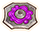</td>
      <td>Grimy Trap</td>
      <td>Turns some food items in the Toolbox into Grimy Food. If a non-leader Pokemon steps on it, any food they're carrying turns into Grimy Food.</td>
    </tr>
    <tr>
      <td></td>
      <td>Grudge Trap</td>
      <td>1-4 Pokemon appear, then all enemy Pokemon on the floor gain Grudge status. Strong Foe can appear via this trap in dungeons where Strong Foes are enabled. Attacking an enemy that has Grudge status reduces your move's PP to 0. Grudge status lasts for 2 turns, and guest Pokemon can attack without downsides.</td>
    </tr>
    <tr>
      <td>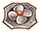</td>
      <td>Gust Trap</td>
      <td>Deals knockback (10 tiles) in a random direction. Deals 5 damage if you collide with another Pokemon or hit a wall. If you land on a tile you normally can't walk on, you'll warp to a different spot. Nothing happens if you have the Suction Cups ability.</td>
    </tr>
    <tr>
      <td></td>
      <td>Hunger Trap</td>
      <td>Lowers belly of the Pokemon who stepped on it by 10. This effect can't be nullified by a Tight Belt. Doesn't always break after activation.</td>
    </tr>
    <tr>
      <td></td>
      <td>Mud Trap</td>
      <td>Sharply lowers either Attack, Defense, Sp. Atk, or Sp. Def at random. No effect on Pokemon with the White Smoke or Clear Body abilities, Healthy status, or those holding a Twist Band.</td>
    </tr>
    <tr>
      <td>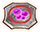</td>
      <td>Poison Trap</td>
      <td>Inflicts Poisoned status on the Pokemon who stepped on it. No effect on Poison or Steel types, Pokemon with the Immunity ability, or those holding a Pecha Scarf.</td>
    </tr>
    <tr>
      <td>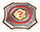</td>
      <td>Pokemon Trap</td>
      <td>Items in the room transform into enemy Pokemon (Max: 20). If a Pokemon is standing on an item, the item won't turn into an enemy Pokemon. Strong Foe can appear via this trap in dungeons where Strong Foes are enabled. Only 5 items transform if it's in a room with a non-active Monster House. If you manually activate it, the enemy Pokemon will get to act first.</td>
    </tr>
    <tr>
      <td></td>
      <td>PP Leech Trap</td>
      <td>Lowers the PP of one of the moves known by the Pokemon who stepped on it to 0. Nothing happens if all moves are already at 0 PP.</td>
    </tr>
    <tr>
      <td>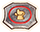</td>
      <td>Random Trap</td>
      <td>Becomes one of the other traps that can generate in the current dungeon, and activates for all party members instead of only the one who stepped on it.</td>
    </tr>
    <tr>
      <td>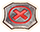</td>
      <td>Seal Trap</td>
      <td>One of the moves known by the Pokemon who stepped on it becomes Sealed. This effect stacks, so if you step on another Seal Trap, another move gets Sealed. Sealed status can be cured by using a status healing move or Max Elixir. The status can also be cured over time via Natural Cure or Shed Skin abilities.</td>
    </tr>
    <tr>
      <td>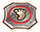</td>
      <td>Slow Trap</td>
      <td>Decreases Travel Speed of the Pokemon who stepped on it.</td>
    </tr>
    <tr>
      <td>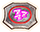</td>
      <td>Slumber Trap</td>
      <td>Inflicts Sleep status on the Pokemon who stepped on it. No effect on Pokemon with the Insomnia or Vital Spirit abilities, Sleepless status, or those holding an Insomniscope.</td>
    </tr>
    <tr>
      <td>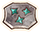</td>
      <td>Spikes</td>
      <td>The Pokemon who stepped on it takes 30 damage. Created by using the Spikes move.</td>
    </tr>
    <tr>
      <td></td>
      <td>Spiky Trap</td>
      <td>The Pokemon who stepped on it takes 25 damage.</td>
    </tr>
    <tr>
      <td></td>
      <td>Spin Trap</td>
      <td>Inflicts Confused status on the Pokemon who stepped on it. No effect on Pokemon with the Own Tempo ability or those holding a Persim Band.</td>
    </tr>
    <tr>
      <td>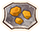</td>
      <td>Stealth Rock</td>
      <td>The Pokemon who stepped on it takes Rock type damage. This trap can activate for party members even when hidden. Created by using the Stealth Rock move. Doesn't always break after activation.</td>
    </tr>
    <tr>
      <td>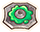</td>
      <td>Sticky Trap</td>
      <td>1 item in the Toolbox becomes sticky (unusable), selected randomly. If a non-leader Pokemon steps on it, their held item becomes sticky. A sticky held item has no effect, and can't be unequipped. No-Stick Cap protects items, and Cleanse Orb removes sticky status from all items. If present, Decoy Seed (non-sticky) is prioritized.</td>
    </tr>
    <tr>
      <td>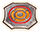</td>
      <td>Summon Trap</td>
      <td>1~4 enemy Pokemon appear around the Pokemon who stepped on it. Strong Foe can appear via this trap in dungeons where Strong Foes are enabled. If you manually activate it, the enemy Pokemon will get to act first.</td>
    </tr>
    <tr>
      <td>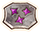</td>
      <td>Toxic Spikes</td>
      <td>The Pokemon who stepped on it takes 20 damage and gains Poisoned status. Damage still occurs even if the Pokemon is immune to poison. Created by using the Toxic Spikes move.</td>
    </tr>
    <tr>
      <td></td>
      <td>Trip Trap</td>
      <td>Makes you drop at least 1 item from your Toolbox. If present, Decoy Seed (non-sticky) is prioritized. If you have multiple Decoy Seeds, up to 3 of them will be dropped.</td>
    </tr>
    <tr>
      <td>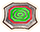</td>
      <td>Warp Trap</td>
      <td>Warps the Pokemon who stepped on it to a different spot on the floor. Nothing happens if you have the Suction Cups ability.</td>
    </tr>
  </tbody>
</table>

# Non-Trap List

<table class="trapTable">
  <thead>
    <tr>
      <th>Image</th>
      <th>Name</th>
      <th>Effect</th>
    </tr>
  </thead>
  <tbody>
    <tr>
      <td></td>
      <td>Carpet</td>
      <td>Denotes the area of a Kecleon Shop. Leaving a Carpet tile without paying for merchandise triggers Thief Mode.</td>
    </tr>
    <tr>
      <td></td>
      <td>Ditto</td>
      <td>Dittos can be disguised as items at the start of a floor. The item vanishes and the enemy Ditto appears next to the Pokemon who stepped on it. If the Ditto transforms, it can inflict Confused status on other party members. (Nothing happens if a guest Pokemon steps on a Ditto)</td>
    </tr>
    <tr>
      <td></td>
      <td>Sparkling Floor</td>
      <td>Step on it to uncover a rare item. On rare occasions, an enemy Pokemon jumps out instead.</td>
    </tr>
    <tr>
      <td></td>
      <td>Stairs</td>
      <td>Use this tile to advance to the next floor. Can also be used to escape if you've finished all rescue jobs.</td>
    </tr>
    <tr>
      <td></td>
      <td>Training Switch</td>
      <td>Gives Trained status to all party members. Trained status makes it easier to level up moves through usage.</td>
    </tr>
    <tr>
      <td>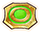</td>
      <td>Wonder Tile</td>
      <td>Resets all stat changes for the Pokemon who stepped on it. This includes boosted stats, not just lowered stats.</td>
    </tr>
  </tbody>
</table>
