# Overview

# Items

<table class="wonderMailItems">
  <tr>
    <th>No</th>
    <th>Name</th>
    <th>Code</th>
    <th>Items</th>
  </tr>
  <tr>
    <td>1</td>
    <td>HP Recovery Set</td>
    <td class="centeredText">F S H H 6 S R 0</td>
    <td>Oran Berry x 10 &nbsp; 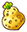Sitrus Berry x 1 &nbsp; Reviver Seed x 1</td>
  </tr>
  <tr>
    <td>2</td>
    <td>Oran Berry Bundle</td>
    <td class="centeredText">R 9 9 4 5 P C N</td>
    <td>Oran Berry x 18</td>
  </tr>
  <tr>
    <td>3</td>
    <td>Reviver Seed Set</td>
    <td class="centeredText">5 P J Q M C C J</td>
    <td>Tiny Reviver Seed x 5 &nbsp; Reviver Seed x 2 &nbsp; Revive All Orb x 1</td>
  </tr>
  <tr>
    <td>4</td>
    <td>Handy Berry Set</td>
    <td class="centeredText">5 J M P H 7 K 5</td>
    <td>Pecha Berry x 5 &nbsp; Cheri Berry x 5 &nbsp; Tiny Reviver Seed x 2</td>
  </tr>
  <tr>
    <td>5</td>
    <td>Useful Berry Set</td>
    <td class="centeredText">3 R 6 2 C R 6 3</td>
    <td>Rawst Berry x 5 &nbsp; Chesto Berry x 5 &nbsp; Tiny Reviver Seed x 2</td>
  </tr>
  <tr>
    <td>6</td>
    <td>Lovely Seed Set</td>
    <td class="centeredText">H 8 P J T W F 2</td>
    <td>Heal Seed x 3 &nbsp; Tiny Reviver Seed x 2</td>
  </tr>
  <tr>
    <td>7</td>
    <td>Hungry Set</td>
    <td class="centeredText">N 3 Q W 5 J S K</td>
    <td>Apple x 5 &nbsp; Big Apple x 5</td>
  </tr>
  <tr>
    <td>8</td>
    <td>Full Belly Set</td>
    <td class="centeredText">1 Y 5 K 0 K 1 S</td>
    <td>Apple x 5 &nbsp; Perfect Apple x 3</td>
  </tr>
  <tr>
    <td>9</td>
    <td>Safety Set</td>
    <td class="centeredText">3 X N S Q M Q X</td>
    <td>Escape Orb x 3 &nbsp; Rollcall Orb x 3 &nbsp; Revive All Orb x 1</td>
  </tr>
  <tr>
    <td>10</td>
    <td>Tough Battling Set</td>
    <td class="centeredText">H 5 F Y 9 4 8 M</td>
    <td>All Power-Up Orb x 3 &nbsp; All Dodge Orb x 3</td>
  </tr>
  <tr>
    <td>11</td>
    <td>Voluminous Set</td>
    <td class="centeredText">9 6 1 W F 0 M N </td>
    <td>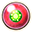See-Trap Orb x 1 &nbsp; Trawl Orb x 2 &nbsp; Storage Orb x 2</td>
  </tr>
  <tr>
    <td>12</td>
    <td>Hard Times Set</td>
    <td class="centeredText">S F S J W K 0 H</td>
    <td>Helper Orb x 3 &nbsp; Revive All Orb x 2</td>
  </tr>
  <tr>
    <td>13</td>
    <td>Friendly Set</td>
    <td class="centeredText">Q X W 5 M M N 1</td>
    <td>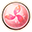Inviting Orb x 3 &nbsp; 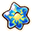Rare Quality Orb x 3 &nbsp; Wigglytuff Orb x 1</td>
  </tr>
  <tr>
    <td>14</td>
    <td>Boss Battle Set</td>
    <td class="centeredText">S K 5 P 7 7 8 R</td>
    <td>All Power-Up Orb x 2 &nbsp; All Dodge Orb x 2 &nbsp; All Protect Orb x 2</td>
  </tr>
  <tr>
    <td>15</td>
    <td>Monster House Provisions</td>
    <td class="centeredText">N Y 7 J P 8 Q M</td>
    <td>One-Shot Orb x 2 &nbsp; Petrify Orb x 3 &nbsp; Spurn Orb x 3</td>
  </tr>
  <tr>
    <td>16</td>
    <td>Relief Gift</td>
    <td class="centeredText">T Y 2 6 4 4 6 X</td>
    <td>Cleanse Orb x 5 &nbsp; Health Orb x 5</td>
  </tr>
  <tr>
    <td>17</td>
    <td>Expedition Gift</td>
    <td class="centeredText">0 M N 2 F 0 C N</td>
    <td>See-Trap Orb x 5 &nbsp; 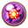Trapbust Orb x 5</td>
  </tr>
  <tr>
    <td>18</td>
    <td>Support Gift</td>
    <td class="centeredText">W J N T Y 4 7 8</td>
    <td>Evasion Orb x 10</td>
  </tr>
  <tr>
    <td>19</td>
    <td>Barrier Gift</td>
    <td class="centeredText">Y 6 4 9 3 N 3 S</td>
    <td>Foe-Hold Orb x 3 &nbsp; Foe-Seal Orb x 5</td>
  </tr>
  <tr>
    <td>20</td>
    <td>Predicament Gift</td>
    <td class="centeredText">7 F W 6 2 7 C K</td>
    <td>Slumber Orb x 5 &nbsp; Totter Orb x 5</td>
  </tr>
  <tr>
    <td>21</td>
    <td>Brawl Gift</td>
    <td class="centeredText">C F S H 9 6 2 H</td>
    <td>Slow Orb x 5 &nbsp; Quick Orb x 5</td>
  </tr>
  <tr>
    <td>22</td>
    <td>Strong-Foe Resistance Gift</td>
    <td class="centeredText">4 7 K 2 K 5 R 3</td>
    <td>Violent Seed x 3 &nbsp; Stun Seed x 10 &nbsp; Tiny Reviver Seed x 3</td>
  </tr>
  <tr>
    <td>23</td>
    <td>Gift from Cacnea</td>
    <td class="centeredText">S H 8 X M F 1 T</td>
    <td>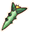Cacnea Spike x 120</td>
  </tr>
  <tr>
    <td>24</td>
    <td>Cacnea Collection</td>
    <td class="centeredText">4 5 Q S P H F 4</td>
    <td>Cacnea Spike x 120</td>
  </tr>
  <tr>
    <td>25</td>
    <td>Gift from Corsola</td>
    <td class="centeredText">3 T W J M K 2 C</td>
    <td>Corsola Twig x 120</td>
  </tr>
  <tr>
    <td>26</td>
    <td>Corsola Collection</td>
    <td class="centeredText">J T 3 M Q Y 7 9</td>
    <td>Corsola Twig x 120</td>
  </tr>
  <tr>
    <td>27</td>
    <td>Gift from Graveler</td>
    <td class="centeredText">8 Q X R 9 3 P 5</td>
    <td>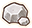Geo Pebble x 40 &nbsp; 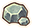Gravelerock x 40 &nbsp; 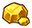Golden Fossil x 20</td>
  </tr>
  <tr>
    <td>28</td>
    <td>Rainbow Gummi Assortment</td>
    <td class="centeredText">S N 3 X Q S F W</td>
    <td>Rainbow Gummi x 6</td>
  </tr>
  <tr>
    <td>29</td>
    <td>Special Gummi Sample</td>
    <td class="centeredText">H 6 W 7 K 2 6 2</td>
    <td>DX Gummi x 2</td>
  </tr>
  <tr>
    <td>30</td>
    <td>Lovely Gummi Assortment</td>
    <td class="centeredText">X M K 9 5 K 4 9</td>
    <td>Rainbow Gummi x 3 &nbsp; DX Gummi x 1</td>
  </tr>
  <tr>
    <td>31</td>
    <td>Attack Move Pack</td>
    <td class="centeredText">W C J T 2 7 5 J</td>
    <td>Rainbow Gummi x 3 &nbsp; Power Drink x 3</td>
  </tr>
  <tr>
    <td>32</td>
    <td>Move Technique Pack</td>
    <td class="centeredText">6 X W H H 7 J M</td>
    <td>Rainbow Gummi x 3 &nbsp; 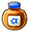Accuracy Drink x 3</td>
  </tr>
  <tr>
    <td>33</td>
    <td>Move Stamina Pack</td>
    <td class="centeredText">Y 4 9 0 C J M R</td>
    <td>Rainbow Gummi x 3 &nbsp; PP-Up Drink x 3</td>
  </tr>
  <tr>
    <td>34</td>
    <td>Power Boost Set</td>
    <td class="centeredText">J Y 3 X Q W 5 C</td>
    <td>Protein x 2 &nbsp; Iron x 2</td>
  </tr>
  <tr>
    <td>35</td>
    <td>Magic Boost Set</td>
    <td class="centeredText">K 0 F X W K 7 J</td>
    <td>Calcium x 2 &nbsp; Zinc x 2</td>
  </tr>
  <tr>
    <td>36</td>
    <td>Physical Boost Set</td>
    <td class="centeredText">0 R 7 9 1 0 P 7</td>
    <td>Life Seed x 2 &nbsp; Carbos x 2</td>
  </tr>
  <tr>
    <td>37</td>
    <td>Move Strengthening Set</td>
    <td class="centeredText">X T 4 9 8 S P 7</td>
    <td>Power Drink x 2 &nbsp; Accuracy Drink x 2 &nbsp; PP-Up Drink x 2</td>
  </tr>
  <tr>
    <td>38</td>
    <td>PP Filling Set</td>
    <td class="centeredText">S J P 7 6 4 2 C</td>
    <td>Max Ether x 5 &nbsp; Max Elixir x 2</td>
  </tr>
  <tr>
    <td>39</td>
    <td>Blue Pouch</td>
    <td class="centeredText">9 0 P 7 8 R 9 6</td>
    <td>Calcium x 3 &nbsp; Accuracy Drink x 3</td>
  </tr>
  <tr>
    <td>40</td>
    <td>Red Pouch</td>
    <td class="centeredText">M C C H 6 X Y 6</td>
    <td>Power Drink x 3 &nbsp; Iron x 3</td>
  </tr>
  <tr>
    <td>41</td>
    <td>Green Pouch</td>
    <td class="centeredText">7 7 6 S J W J S</td>
    <td>PP-Up Drink x 3 &nbsp; Max Elixir x 3</td>
  </tr>
  <tr>
    <td>42</td>
    <td>Training Set</td>
    <td class="centeredText">Y 9 9 1 1 4 1 2</td>
    <td>Bronze Dojo Ticket x 3 &nbsp; Silver Dojo Ticket x 2 &nbsp; Gold Dojo Ticket x 1</td>
  </tr>
  <tr>
    <td>43</td>
    <td>Powerful Ribbon Set</td>
    <td class="centeredText">2 5 Q Q T S C R</td>
    <td>Power Band x 1 &nbsp; Defense Scarf x 1 &nbsp; Gold Ribbon x 1</td>
  </tr>
  <tr>
    <td>44</td>
    <td>Magical Ribbon Set</td>
    <td class="centeredText">9 5 R 1 W 6 S J</td>
    <td>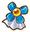Special Band x 1 &nbsp; Zinc Band x 1 &nbsp; Gold Ribbon x 1</td>
  </tr>
  <tr>
    <td>45</td>
    <td>Technical Ribbon Set</td>
    <td class="centeredText">C M Q M F X W 6</td>
    <td>Mach Ribbon x 1 &nbsp; Gold Ribbon x 1</td>
  </tr>
  <tr>
    <td>46</td>
    <td>Fire TM</td>
    <td class="centeredText">P 5 R 9 4 1 1 S</td>
    <td>Flamethrower TM x 1</td>
  </tr>
  <tr>
    <td>47</td>
    <td>Water TM</td>
    <td class="centeredText">J R 4 1 1 3 Q S</td>
    <td>Waterfall TM x 1</td>
  </tr>
  <tr>
    <td>48</td>
    <td>Electric TM</td>
    <td class="centeredText">R 1 3 R 6 X Y 0</td>
    <td>Thunderbolt TM x 1</td>
  </tr>
  <tr>
    <td>49</td>
    <td>Grass TM</td>
    <td class="centeredText">N 0 R 7 K 9 3 R</td>
    <td>Energy Ball TM x 1</td>
  </tr>
  <tr>
    <td>50</td>
    <td>Ice TM</td>
    <td class="centeredText">X M K 5 J Q Q M</td>
    <td>Ice Beam TM x 1</td>
  </tr>
  <tr>
    <td>51</td>
    <td>Fighting TM</td>
    <td class="centeredText">7 8 S H 6 4 6 3</td>
    <td>Focus Blast TM x 1</td>
  </tr>
  <tr>
    <td>52</td>
    <td>Ground TM</td>
    <td class="centeredText">P F X Q P C N 3</td>
    <td>Bulldoze TM x 1</td>
  </tr>
  <tr>
    <td>53</td>
    <td>Bug TM</td>
    <td class="centeredText">3 T Y 1 X W 9 9</td>
    <td>Leech Life TM x 1</td>
  </tr>
  <tr>
    <td>54</td>
    <td>Ghost TM</td>
    <td class="centeredText">9 0 P 7 C Q P 9</td>
    <td>Shadow Ball TM x 1</td>
  </tr>
  <tr>
    <td>55</td>
    <td>Dark TM</td>
    <td class="centeredText">X N Y 8 P K 4 0</td>
    <td>Brutal Swing TM x 1</td>
  </tr>
  <tr>
    <td>56</td>
    <td>Steel TM</td>
    <td class="centeredText">W 9 5 R 9 1 X T</td>
    <td>Smart Strike TM x 1</td>
  </tr>
  <tr>
    <td>57</td>
    <td>Apple Bundle</td>
    <td class="centeredText">5 J S K 2 C M C</td>
    <td>Apple x 18</td>
  </tr>
  <tr>
    <td>58</td>
    <td>Max Ether Bundle</td>
    <td class="centeredText">6 X T 1 X P 9 8</td>
    <td>Max Ether x 18</td>
  </tr>
  <tr>
    <td>59</td>
    <td>Happy Letter</td>
    <td class="centeredText">S R 0 K 5 Q R 9</td>
    <td>Joy Seed x 3</td>
  </tr>
</table>

# Pokemon

Move colors = Level Up, TM Exclusive, Gulpin Exclusive

<table class="wonderMailPokemon">
  <tr>
    <th rowspan="2">Image</th>
    <th rowspan="2">Name</th>
    <th rowspan="2">Code</th>
    <th>Location</th>
    <th>Ability</th>
    <th>Lv</th>
    <th>HP</th>
    <th>Atk</th>
    <th>Def</th>
    <th>SpA</th>
    <th>SpD</th>
    <th>Spe</th>
  </tr>
  <tr>
    <th>Camp</th>
    <th>Rare Quality</th>
    <th colspan="7">Moves</th>
  </tr>
  <tr>
    <td rowspan="2"></td>
    <td rowspan="2" class="leftText">Smoochum  </td>
    <td rowspan="2" class="wmCode">9 2 J M R 4 8 W</td>
    <td>Mt. Steel 3F</td>
    <td>Oblivious</td>
    <td>10</td>
    <td>46</td>
    <td>18</td>
    <td>15</td>
    <td>27</td>
    <td>21</td>
    <td>23</td>
  </tr>
  <tr>
    <td>Frigid Cavern</td>
    <td>Small Stomach</td>
    <td colspan="7">Lick / Ice Beam / Zen Heabutt / Water Pulse</td>
  </tr>
  <tr>
    <td colspan="12" class="tableDivider"></td>
  </tr>
  <tr>
    <td rowspan="2"></td>
    <td rowspan="2" class="leftText">Mareep </td>
    <td rowspan="2" class="wmCode">9 9 1 Y 5 K 4 7</td>
    <td>Mt. Steel 5F</td>
    <td>Static</td>
    <td>10</td>
    <td>46</td>
    <td>18</td>
    <td>18</td>
    <td>21</td>
    <td>18</td>
    <td>18</td>
  </tr>
  <tr>
    <td>Thunder Crag</td>
    <td>Mind Over Matter</td>
    <td colspan="7">Tackle / Charge Beam / Signal Beam / Electroweb</td>
  </tr>
  <tr>
    <td colspan="12" class="tableDivider"></td>
  </tr>
  <tr>
    <td rowspan="2"></td>
    <td rowspan="2" class="leftText">Sableye  </td>
    <td rowspan="2" class="wmCode">9 1 S R 2 H 5 J</td>
    <td>Mt. Steel 8F</td>
    <td>Keen Eye</td>
    <td>12</td>
    <td>46</td>
    <td>25</td>
    <td>22</td>
    <td>22</td>
    <td>22</td>
    <td>22</td>
  </tr>
  <tr>
    <td>Darkness Ridge</td>
    <td>Strike Back</td>
    <td colspan="7">Shadow Claw / Shadow Ball / Zen Headbutt / Foul Play</td>
  </tr>
  <tr>
    <td colspan="12" class="tableDivider"></td>
  </tr>
  <tr>
    <td rowspan="2"></td>
    <td rowspan="2" class="leftText">Larvitar  </td>
    <td rowspan="2" class="wmCode">5 J S M N W F 0</td>
    <td>Sinister Woods 5F</td>
    <td>Guts</td>
    <td>13</td>
    <td>49</td>
    <td>25</td>
    <td>22</td>
    <td>22</td>
    <td>22</td>
    <td>22</td>
  </tr>
  <tr>
    <td>Mt. Cleft</td>
    <td>Leap Ahead</td>
    <td colspan="7">Bite / Stone Edge / Iron Tail / Earth Power</td>
  </tr>
  <tr>
    <td colspan="12" class="tableDivider"></td>
  </tr>
  <tr>
    <td rowspan="2"></td>
    <td rowspan="2" class="leftText">Beautifly  </td>
    <td rowspan="2" class="wmCode">C N T S N 2 F 1</td>
    <td>Sinister Woods 10F</td>
    <td>Swarm</td>
    <td>13</td>
    <td>47</td>
    <td>20</td>
    <td>20</td>
    <td>16</td>
    <td>16</td>
    <td>19</td>
  </tr>
  <tr>
    <td>Stump Forest</td>
    <td>Bargain</td>
    <td colspan="7">Gust / Energy Ball / Signal Beam / Electroweb</td>
  </tr>
  <tr>
    <td colspan="12" class="tableDivider"></td>
  </tr>
  <tr>
    <td rowspan="2"></td>
    <td rowspan="2" class="leftText">Chingling </td>
    <td rowspan="2" class="wmCode">R 6 T 1 X S H 5</td>
    <td>Silent Chasm 3F</td>
    <td>Levitate</td>
    <td>15</td>
    <td>51</td>
    <td>24</td>
    <td>24</td>
    <td>33</td>
    <td>24</td>
    <td>18</td>
  </tr>
  <tr>
    <td>Thunder Crag</td>
    <td>Notorious Restoration</td>
    <td colspan="7">Confusion / Psychic / Icy Wind / Dazzling Gleam</td>
  </tr>
  <tr>
    <td colspan="12" class="tableDivider"></td>
  </tr>
  <tr>
    <td rowspan="2"></td>
    <td rowspan="2" class="leftText">Rhyhorn  </td>
    <td rowspan="2" class="wmCode">R 8 Y 4 8 Q X R</td>
    <td>Silent Chasm 7F</td>
    <td>Lightning Rod</td>
    <td>15</td>
    <td>57</td>
    <td>38</td>
    <td>34</td>
    <td>21</td>
    <td>21</td>
    <td>24</td>
  </tr>
  <tr>
    <td>Safari</td>
    <td>Rapid Bull's-Eyes</td>
    <td colspan="7">Fury Attack / Stone Edge / Icy Wind / Drill Run</td>
  </tr>
  <tr>
    <td colspan="12" class="tableDivider"></td>
  </tr>
  <tr>
    <td rowspan="2"></td>
    <td rowspan="2" class="leftText">Wailmer </td>
    <td rowspan="2" class="wmCode">0 R 5 H 7 6 X Q</td>
    <td>Great Canyon 12F</td>
    <td>Water Veil</td>
    <td>33</td>
    <td>86</td>
    <td>62</td>
    <td>41</td>
    <td>52</td>
    <td>41</td>
    <td>50</td>
  </tr>
  <tr>
    <td>Serene Sea</td>
    <td>Tight Formation</td>
    <td colspan="7">Water Spout / Blizzard / Scald / Zen Headbutt</td>
  </tr>
  <tr>
    <td colspan="12" class="tableDivider"></td>
  </tr>
  <tr>
    <td rowspan="2"></td>
    <td rowspan="2" class="leftText">Mantyke  </td>
    <td rowspan="2" class="wmCode">M F 0 K 5 C C N</td>
    <td>Lapis Cave 10F</td>
    <td>Swift Swim</td>
    <td>30</td>
    <td>65</td>
    <td>40</td>
    <td>45</td>
    <td>50</td>
    <td>65</td>
    <td>50</td>
  </tr>
  <tr>
    <td>Serene Sea</td>
    <td>Squeeze Out</td>
    <td colspan="7">Bubble Beam / Ice Beam / Icy Wind / Hydro Pump</td>
  </tr>
  <tr>
    <td colspan="12" class="tableDivider"></td>
  </tr>
  <tr>
    <td rowspan="2"></td>
    <td rowspan="2" class="leftText">Misdreavus </td>
    <td rowspan="2" class="wmCode">5 K 0 K 0 K 2 K</td>
    <td>Lapis Cave 14F</td>
    <td>Levitate</td>
    <td>31</td>
    <td>66</td>
    <td>45</td>
    <td>46</td>
    <td>61</td>
    <td>50</td>
    <td>58</td>
  </tr>
  <tr>
    <td>Darkness Ridge</td>
    <td>Funnel Fun</td>
    <td colspan="7">Psybeam / Shadow Ball / Dark Pulse / Icy Wind</td>
  </tr>
  <tr>
    <td colspan="12" class="tableDivider"></td>
  </tr>
  <tr>
    <td rowspan="2"></td>
    <td rowspan="2" class="leftText">Clefairy </td>
    <td rowspan="2" class="wmCode">8 T T 4 9 8 W 8</td>
    <td>Mt. Blaze 14F</td>
    <td>Magic Guard</td>
    <td>34</td>
    <td>68</td>
    <td>44</td>
    <td>42</td>
    <td>49</td>
    <td>46</td>
    <td>48</td>
  </tr>
  <tr>
    <td>Mt. Moonview</td>
    <td>Brawl</td>
    <td colspan="7">Disarming Voice / Dazzling Gleam / Hyper Voice / Shock Wave</td>
  </tr>
  <tr>
    <td colspan="12" class="tableDivider"></td>
  </tr>
  <tr>
    <td rowspan="2"></td>
    <td rowspan="2" class="leftText">Roselia  </td>
    <td rowspan="2" class="wmCode">K 7 6 2 C J W F</td>
    <td>Frosty Forest 8F</td>
    <td>Natural Cure</td>
    <td>37</td>
    <td>66</td>
    <td>51</td>
    <td>43</td>
    <td>67</td>
    <td>47</td>
    <td>57</td>
  </tr>
  <tr>
    <td>Beau Plains</td>
    <td>Food Finder</td>
    <td colspan="7">Petal Blizzard / Energy Ball / Shadow Ball / Sludge Bomb</td>
  </tr>
  <tr>
    <td colspan="12" class="tableDivider"></td>
  </tr>
  <tr>
    <td rowspan="2"></td>
    <td rowspan="2" class="leftText">Togetic  </td>
    <td rowspan="2" class="wmCode">M H J R 6 2 5 M</td>
    <td>Frosty Forest 12F</td>
    <td>Serene Grace</td>
    <td>31</td>
    <td>60</td>
    <td>40</td>
    <td>51</td>
    <td>51</td>
    <td>50</td>
    <td>46</td>
  </tr>
  <tr>
    <td>Flyaway Forest</td>
    <td>Notorious Restoration</td>
    <td colspan="7">Aerial Ace / Dazzling Gleam / Heat Wave / Water Pulse</td>
  </tr>
  <tr>
    <td colspan="12" class="tableDivider"></td>
  </tr>
  <tr>
    <td rowspan="2"></td>
    <td rowspan="2" class="leftText">Slowbro  </td>
    <td rowspan="2" class="wmCode">6 Y 6 S N W H F</td>
    <td>Mt. Freeze 11F</td>
    <td>Own Tempo</td>
    <td>37</td>
    <td>79</td>
    <td>55</td>
    <td>63</td>
    <td>65</td>
    <td>47</td>
    <td>51</td>
  </tr>
  <tr>
    <td>Bountiful Sea</td>
    <td>Notorious Healing</td>
    <td colspan="7">Zen Headbutt / Blizzard / Aqua Tail / Signal Beam</td>
  </tr>
  <tr>
    <td colspan="12" class="tableDivider"></td>
  </tr>
  <tr>
    <td rowspan="2"></td>
    <td rowspan="2" class="leftText">Dragonair </td>
    <td rowspan="2" class="wmCode">H K 5 R 3 N 4 7</td>
    <td>Mt. Freeze 17F</td>
    <td>Shed Skin</td>
    <td>35</td>
    <td>69</td>
    <td>57</td>
    <td>47</td>
    <td>50</td>
    <td>47</td>
    <td>55</td>
  </tr>
  <tr>
    <td>Mystic Lake</td>
    <td>Shared Happiness</td>
    <td colspan="7">Dragon Rush / Flamethrower / Ice Beam / Outrage</td>
  </tr>
</table>
